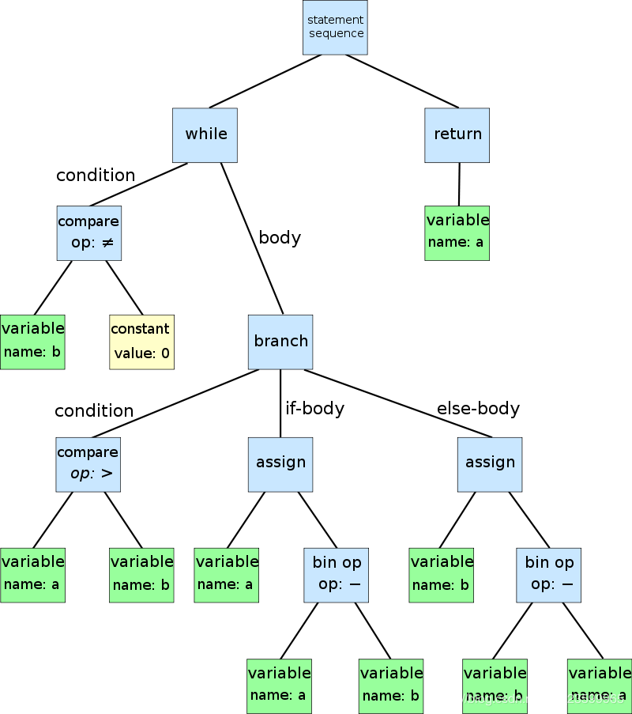

[astexplorer](https://astexplorer.net/)

AST（Abstract Syntax Tree）抽象语法树。

## AST 是什么

在计算机科学中，抽象语法树(AST)，或简称**语法树**，是用编程语言编写的**源代码的抽象语法结构的树表示**。

下面欧几里得算法的抽象语法树如下所示：

```js
while b ≠ 0
  if a > b
    a := a − b
  else
    b := b − a
return a

```



### AST 语法分析可能用到的名词

- `type: Identifier`，基础 Identifier（标志）对象

### recast，语法树分析工具

```bash
yarn global add recast
# 查看编译结果
node recast-demo.js
```

## AST 什么用

AST（Abstract Syntax Tree）**是源代码的抽象语法结构树状表现形式**，Webpack、ESLint、JSX、TypeScript 的编译和模块化规则之间的转化都是通过 AST 来实现对代码的检查、分析以及编译等操作。

这样操作比直接匹配 js 源代码操作要安全的多。

## babel，AST

### babel 原理

babel 是一个**转译器**，感觉相对于**编译器 compiler**，叫转译器 transpiler 更准确，**因为它只是把同种语言的高版本规则翻译成低版本规则**，而不像编译器那样，输出的是另一种更低级的语言代码。

但是和编译器类似，babel 的转译过程也分为三个阶段：

- parsing、
- transforming、
- generating，

以 ES6 代码转译为 ES5 代码为例，babel 转译的具体过程如下：

ES6 代码输入 ==》 babylon 进行解析 ==》 得到 AST
==》 plugin 用 babel-traverse 对 AST 树进行遍历转译 ==》 得到新的 AST 树
==》 用 babel-generator 通过 AST 树生成 ES5 代码

[babel 语法树解析](./babel语法树解析.png)

esprima、estraverse 和 escodegen 模块是 babel 操作 AST 的三个重要模块，也是实现 babel 的核心依赖，下面是分别介绍三个模块的作用。

- esprima 将 JS 转换成 AST
- estraverse 遍历和修改 AST
- escodegen 将 AST 转换成 JS

### 实现 Babel 语法转换插件，babel 转换 ES6 语法到 ES5

实现语**法转换插件**需要借助 babel-core 和 babel-types 两个模块，其实这两个模块就是依赖 esprima、estraverse 和 escodegen 的。

这里可以通过`babel-core`和`babel-types`来实现常用的一些插件，就是通过修改语法树的方式来实现代码的转换。

`npm install babel-core babel-types`

具体参考：[实现 Babel 语法转换插件](https://segmentfault.com/a/1190000016706589)

### 常用插件及其作用，Toolings

- **@babel/parser** 将源代码解析成 AST。
- **@babel/generator** 将 AST 解码生 js 代码。
- @babel/core 包括了整个 babel 工作流，也就是说在@babel/core 里面我们会使用到@babel/parser、transformer[s]、以及@babel/generator。
- @babel/code-frame **用于生成错误信息**并且打印出错误原因和错误行数。（其实就是个 console 工具类）
- @babel/helpers 也是工具类，提供了一些内置的函数实现，主要用于 babel 插件的开发。
- @babel/runtime 也是工具类，但是是为了 babel 编译时提供一些基础工具库。作用于 transformer[s]阶段，当然这是一个工具库，如果要使用这个工具库，还需要引入@babel/plugin-transform-runtime，它才是 transformer[s]阶段里面的主角。
- @babel/template 也是工具类，主要用途是**为 parser 提供模板引擎**，更加快速的转化成 AST
- **@babel/traverse** 也是工具类，主要用途是来**遍历 AST 树**，也就是在@babel/generator 过程中生效。
- **@babel/types** 也是工具类，主要用途是在创建 AST 的过程中**判断各种语法的类型。**

#### eui-server 中用到的 babel 模块

- "@babel/generator": "^7.7.4", 生成 es5
- "@babel/parser": "^7.7.5", 解析
- "@babel/traverse": "^7.7.4", 遍历
- "@babel/types": "^7.7.4", 方法集

## webpack 插件，babel 分析 react 语法树，修改语法树的阶段，再传递给 webpack，去渲染页面，查看一下 umi ui 的原理

页面修改 -> 消息通知插件 -> 去修改 webpack 编译的 AST 树 -> AST 树修改 -> 渲染到页面上

由于 Umi 3 使用微内核架构，将之前 Umi UI 拆分到独立的仓库，通过加载 `@umijs/preset-ui` 使用 Umi UI。
