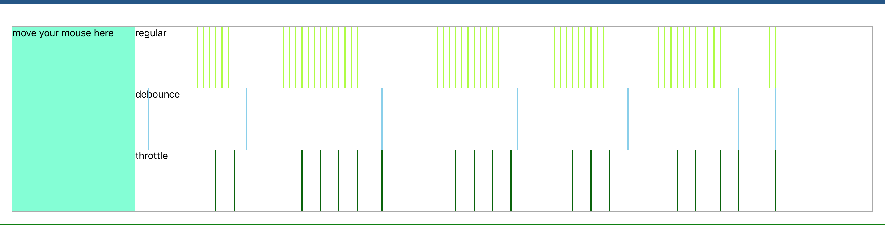

[TOC]



如下展示原理，开发过程中一般还是使用 lodash。

注意保存当前的上下文环境和参数值：

```js
var context = this,
  args = arguments;
```

## 函数去抖 debounce，延迟执行，避免频繁执行，后来触发，取消前面的触发

用途：

- ondrag 改变浏览器大小
- 触发 onresize 函数

函数去抖，如果在短时间内**连续抖动**，就会只执行最后一次。

如“一个函数 100 毫秒内只执行一次”。也许一个函数在很集中的时间内被调用 1000 次，**超过 3 秒，然后停止调用**。

如果我们在 100 毫秒内将其去抖动，该函数将**仅启动一次 3.1 秒**。函数去抖就是对于一定时间段的连续的函数调用，只让其**执行一次**。

一定时间内有新的触发请求，就取**消前一次**的，知道这一次的时间间隔内没有新的请求。

```js
// 简介版
// func是用户传入需要防抖的函数
// wait是等待时间
// 可以认为是请求了就重置
const debounce = (func, wait = 50) => {
  // 缓存一个定时器id
  let timer = null;
  // 如果已经设定过定时器了就清空上一次的定时器
  // 开始一个新的定时器，延迟执行用户传入的方法
  return function (args) {
    var context = this,
      args = arguments;
    // 重新开始等待wait之后再执行
    if (timer) clearTimeout(timer);
    timer = setTimeout(() => {
      func.apply(context, args);
    }, wait);
  };
};
// immediate，是否立即执行
_.debounce = function (func, wait, immediate) {
  var timeout, result;
  return function () {
    var context = this,
      args = arguments;

    var later = function () {
      timeout = null;
      if (!immediate) result = func.apply(context, args);
    };
    var callNow = immediate && !timeout;
    clearTimeout(timeout);
    timeout = setTimeout(later, wait);
    if (callNow) result = func.apply(context, args);
    return result;
  };
};
```

## 函数节流 throttle，按一定频率执行代码，间隔执行，一定时间内可保证至少执行一次

用途：

- 接口请求
- 用户输入框的一些事件，如 keyup/input

函数节流，节约使用，一定时间内能用一次。

调节强制执行一段时间内可以调用函数的最大次数。

如“每 100 毫秒最多执行一次”。**在正常情况下，我们可以在 10 秒钟内调用此函数 1000 次。如果您每 100 毫秒将其限制为仅一次，则最多只能执行该功能 100 次。**

在一定时间内只允许触发一次，但是在一定的时间内，一定会触发一次。

```js
// 简洁版
// 内部设置定时器，定时时间到重置，期间不接受新的触发请求
// 连续触发，间隔一段时间必然执行一次，可以认为，节流就是多次请求只给一次
function throttle(method, delay) {
  var timer = null;
  var canRun = true;
  return function() {
    var context = this,
      args = arguments;

    // 执行时间内，不允许重新触发
    if (!canRun) {
      return;
    }
    canRun = false;
    // 定时时间到了就执行一次
    timer = setTimeout(function() {
      method.apply(context, args);
      // 定时时间到才能重置
      canRun = true;
    }, delay);
  };
}

// 通过计算事件来执行事件
function throttle(fn,wait){
  let prev = new Date();
  return function(){
    const args = arguments;
    const now = new Date();
    if(now - prev > wait){
     fn.apply(this,args);
     prev = new Date();
  }
}

_.throttle = function(func, wait) {
  var context, args, timeout, result;
  var previous = 0;
  var later = function() {
    previous = new Date();
    timeout = null;
    result = func.apply(context, args);
  };
  return function() {
    var now = new Date();
    var remaining = wait - (now - previous);
    context = this;
    args = arguments;
    if (remaining <= 0) {
      clearTimeout(timeout);
      timeout = null;
      previous = now;
      result = func.apply(context, args);
    } else if (!timeout) {
      timeout = setTimeout(later, remaining);
    }
    return result;
  };
};
```

## 二者根本差别

二者的根本的**区别在于 throttle 保证了在每个 delta T 内至少执行一次**，而 debounce 没有这样的保证。

## 防抖和节流的区别

防抖 debounce，函数去抖，如果在短时间内**连续抖动**，就会只执行最后一次。

1. 通常用在 **ondrag 改变浏览器大小**，
2. 触发 **onresize** 函数

节流 throttle，函数节流 throttle，按一定频率执行代码，间隔执行，一定时间内可保证至少执行一次。常用在

1. 接口请求
2. 用户**输入框的一些事件**，如 keyup/input
