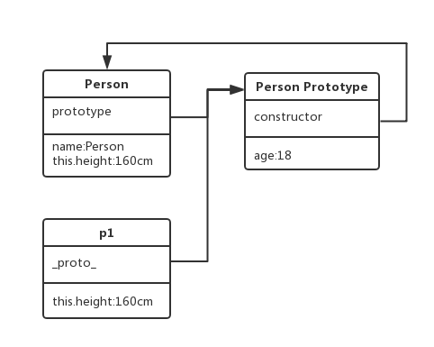

## JavaScript 原型，原型链 ? 有什么特点

### 原型

我们创建的**每个函数都有一个 prototype 属性**，这个属性是一个指针，指向一个对象。这个对象的**用途是**包含可以**由特定类型（该构造函数类型）的所有实例共享的方法和属性**。

prototype 属性不能列举。JavaScript 仅支持通过 prototype 属性进行继承属性和方法。

```js
function Rectangle(x, y) {
  this._length = x;
  this._breadth = y;
}

Rectangle.prototype.getDimensions = function() {
  return {
    length: this._length,
    breadth: this._breadth,
  };
};

var x = new Rectangle(3, 4);
var y = new Rectangle(4, 3);

console.log(x.getDimensions()); // { length: 3, breadth: 4 }
console.log(y.getDimensions()); // { length: 4, breadth: 3 }
```

## 原型链

**原型链的基本原理**：任何一个**实例**，通过**原型链**，找到它上面的**原型**，该原型对象中的方法和属性，**可以被所有的原型实例共享**。

**层层向上直到一个对象的原型为 null**。根据定义，null 没有原型，并作为这个原型链中的最后一个环节。

- 原型可以起到继承的作用。原型里的方法都可以被不同的实例共享：

```js
//给Foo的原型添加 say 函数
Foo.prototype.say = function() {
  console.log('');
};
```

**原型链的关键**：在访问一个实例的时候，**如果实例本身没找到此方法或属性，就往原型上找**。如果还是找不到，继续往上一级的原型上找。

## 创建对象有几种方法

### 方式一：字面量

```js
var obj11 = {name: 'smyh'};
var obj12 = new Object(name: `smyh`); //内置对象（内置的构造函数）
```

> 上面的两种写法，效果是一样的。因为，第一种写法，`obj11`会指向`Object`。

- 第一种写法是：字面量的方式。
- 第二种写法是：内置的构造函数。

### 方式二：通过构造函数+new 操作符

```javascript
var M = function(name) {
  this.name = name;
};
var obj3 = new M('smyhvae');
```

### 方法三：Object.create

```javascript
var p = { name: 'smyhvae' };
var obj3 = Object.create(p); // 此方法创建的对象，是用原型链连接的，继承于p
```

> 第三种方法，很少有人能说出来。这种方式里，`obj3`是实例，p 是 obj3 的原型（name 是 p 原型里的属性），构造函数是`Objecet` 。


## 原型、构造函数、实例


> PS：任何一个函数，如果在前面加了`new`，那就是**构造函数的作用**。

### 原型、构造函数、实例，三者之间的关系



1. 构造函数通过 `new` 生成实例。
2. 构造函数也是函数，构造函数的`prototype`指向原型。（所有的函数有`prototype`属性，但实例没有 `prototype`属性）。
3. 原型对象中有 `constructor`，指向该原型的构造函数。

> 上面的三行，代码演示：

```js
var Foo = function(name) {
  this.name = name;
};
var fn = new Foo('smyhvae');
```

> 上面的代码中，`Foo.prototype.constructor === Foo`的结果是`true`：

4. 实例的`__proto__`指向原型。也就是说，`Foo.__proto__ === M.prototype`。

> 声明：所有的**引用类型**（数组、对象、函数）都有`__proto__`这个属性。

`Foo.__proto__ === Function.prototype`的结果为 true，说明`Foo`这个普通的函数，是`Function`构造函数的一个实例。

### 3.3 `instanceof`的原理


- `instanceof`的**作用**：用于判断**实例**属于哪个**构造函数**。
- `instanceof`的**原理**：判断实例对象的`__proto__`属性，和构造函数的`prototype`属性，是否为同一个引用（是否指向同一个地址）。

> - **注意 1**：虽然说，实例是由构造函数 new 出来的，但是实例的`__proto__`属性引用的是构造函数的`prototype`。也就是说，实例的`__proto__`属性与构造函数本身无关。
> - **注意 2**：在原型链上，原型的上面可能还会有原型，以此类推往上走，继续找`__proto__`属性。这条链上如果能找到， instanceof 的返回结果也是 true。

比如说：

- `foo instance of Foo`的结果为 true，因为`foo.__proto__ === M.prototype`为`true`。
- **`foo instance of Objecet`的结果也为 true**，为`Foo.prototype.__proto__ === Object.prototype`为`true`。

> 但我们不能轻易的说：`foo` 一定是 由`Object`创建的实例`。这句话是错误的。我们来看下一个问题就明白了。

### 分析一个问题

**问题：**已知 A 继承了 B，B 继承了 C。怎么判断 a 是由 A**直接生成**的实例，还是 B 直接生成的实例呢？还是 C 直接生成的实例呢？

> 分析：这就要用到原型的`constructor`属性了。

- `foo.__proto__.constructor === M`的结果为`true`，但是 `foo.__proto__.constructor === Object`的结果为`false`。
- 所以，用 `consturctor`判断就比用 `instanceof`判断，更为严谨。

## new 运算符

> 当`new Foo()`时发生了什么：

- 创建一个**新的空对象实例**。`new Object()`
- 将此空对象的**隐式原型**指向其构造函数的显式原型。
- 执行构造函数（**传入相应的参数**，如果没有参数就不用传），同时 `this` 指向这个**新实例**。
- 如果返回值是一个新对象，那么直接返回该对象；如果无返回值或者返回一个非对象值，那么就将步骤（1）创建的对象返回。

### 使用 new 与不使用 new 实例化对象的区别

```js
// 创建一个类
function Person(name, sex) {
  this.name = name;
  this.sex = sex;
  console.log(this);
}
Person.prototype.say = function() {
  console.log(`my name is ${this.name}!`);
};

// test
// 第一种是构造函数式，即通过new运算符调用构造函数Function来创建函数
var person1 = new Person('xiaoming', 'male');
// 第二种不是实例化，只是调用函数把返回值赋给变量。
var person2 = Person('xiaohong', 'formale');

// 1. 调用之后的返回结果：
person1;
// Person {name: "xiaoming", sex: "male"}
person2;
// undefined
// 2. 调用方法
person1.say();
// my name is xiaoming!

person2.say();
// 报错：Cannot read property 'say' of undefined

// 3. 全局调用name，得到"xiaohong"

// 异同
// 1. 使用new方法最终会返回当前创建的对象，不使用new方法，最终只会是一个函数调用，返回结果依据构造函数内的返回说明。
// 2. 使用new会创建一个对象（函数上下文执行环境在当前对象，this指向当前对象），不使用new的时候，只是创建了几个全局变量（this指向全局）。
// 3. 当使用new 关键字来调用构造函数时，执行上下文从全局对象（window）变成一个空的上下文，这个上下文代表了新生成的实例。因此，this 关键字指向当前创建的实例。
// 4. 默认情况下，如果你的构造函数中没有返回任何内容，就会返回this——当前的上下文。
```

## 继承

javascript 面向对象中继承实现：

1. 我们创建的每个**函数**都有一个 prototype（原型）属性，**这个属性是一个指针，指向一个对象**，而这个对象的**用途**是包含可以由**特定类型**的所有实例共享的属性和方法。
2. 类继承，（extends），创建一个类，让其 prototype 指向另一个**实例**；
3. **对象直接继承**，创建 Object.create， Object.assign（所有**可枚举属性**的值从一个或多个源对象复制到目标对象），不可以扩展原型上的属性

```js
function P() {}
P.prototype.alert = function() {
  alert(this.name);
};
var xm = new P();
Object.assign({}, xm);
```

### 继承的形式

查看 section5-es5 中创建对象与继承.html。

### Javascript 如何实现继承

```js
function Animal(name) {
  this.name = name;
  this.run = function() {
    /*实例方法*/
    console.log(this.name + '在运动');
  };
}
Animal.prototype.work = function() {
  console.log(this.name + '在工作');
};
```

#### 借用构造函数

使用 call 或 apply 方法，将**父对象的构造函数绑定在子对象上**。

```js
function Cat(name, color) {
  Animal.apply(this, arguments);
  this.name = name;
  this.color = color;
}
```

##### 借用构造函数继承的优缺点

没有原型，**则复用无从谈起**。所以我们需要**原型链+借用构造函数的模式**，这种模式称为**组合继承**。

#### 实例继承的优缺点

#### 组合继承，构造函数+原型

```js
function Cat(name, color) {
  Animal.call(this, name);
  this.color = color;
}
Cat.prototype = new Animal();
Cat.prototype.constructor = Cat;
```

##### 组合继承的优缺点

组合式继承是比较常用的一种继承方法，

其背后的思路是**使用原型链实现对原型属性和方法的继承**，

而通过**借用构造函数来实现对实例属性的继承**。这样，既通过在原型上定义方法实现了函数复用，又保证每个实例都有它自己的属性。

缺点：需要调用两次超类的构造函数。在调用子类构造函数的时候，会重写从父类实例继承的属性和方法。

#### 原型式继承

#### 寄生式继承

#### 寄生组合式继承

JS 的继承方式有很多种，**最理想的继承方式是寄生组合式继承**。

借助**构造函数来继承属性**，通过**原型链的混成形式来继承方法**。不必为了指定子类的原型而调用超类的构造函数。

**ES6 实现类的底层原理，需要实现静态方法与变量**。

```js
// 超类
function Person(name) {
  this.name = name;
}
Person.prototype.sayName=function(){
  console.log(this.name+' '+this.gender+' '+this.age);
}

// 子类
function Female(name, gender, age) {
  Person.call(this, name); //第一次调用父类构造函数
  this.age = age;
  this.gender = gender;
}

// 传入超类与子类的构造函数
function inheritPrototype(Female, Person) {
  var protoType = Object.create(Person.prototype);
  protoType.constructor = Female;
  Female.prototype = protoType;
}
// 取代
// Female.prototype=new Person();
// Female.prototype.constrcutor=Female

inheritPrototype(Female, Person);
Female.prototype.sayAge = function() {
  console.log(this.name + ' ' + this.age);
};

var fm = new Female('skila', 'female', 19);

fm.sayName(); // skila female 19
fm.sayAge(); // skila 19
```

#### ES6 语法糖

extends：class ColorPoint extends Point {}

```js
class ColorPoint extends Point {
  constructor(x, y, color) {
    super(x, y); // 调用父类的constructor(x, y)
    this.color = color;
  }
  toString() {
    return this.color + ' ' + super.toString(); // 调用父类的toString()
  }
}
```

## 评价一下三种方法实现继承的优缺点,并改进

```js
function Shape() {}
function Rect() {}
// 方法1
Rect.prototype = new Shape();
// 方法2
Rect.prototype = Shape.prototype;
// 方法3
Rect.prototype = Object.create(Shape.prototype);
Rect.prototype.area = function() {
  // do something
};
```

方法 1：

1. 优点：正确设置原型链实现继承
2. 优点：父类实例属性得到继承，原型链查找效率提高，也能为一些属性提供合理的默认值
3. 缺点：父类实例属性为引用类型时，**不恰当地修改会导致所有子类被修改**
4. 缺点：创建父类实例作为子类原型时，可能无法确定构造函数需要的合理参数，这样提供的参数继承给子类没有实际意义，当子类需要这些参数时应该在构造函数中进行初始化和设置
5. 总结：**继承应该是继承方法而不是属性**，为子类设置父类实例属性应该是通过在子类构造函数中调用父类构造函数进行初始化

方法 2：

1. 优点：正确设置原型链实现继承
2. 缺点：父类构造函数原型与子类相同。修改子类原型添加方法会修改父类

方法 3：

1. 优点：正确设置原型链且避免方法 1.2 中的缺点
2. 缺点：ES5 方法需要注意兼容性

改进：

1. 所有三种方法应该在子类构造函数中调用父类构造函数实现实例属性初始化

```js
function Rect() {
  Shape.call(this);
}
```

2. 用新创建的对象**替代子类默认原型**，设置`Rect.prototype.constructor = Rect;`保证一致性
3. 第三种方法的 polyfill：

```js
function create(obj) {
  if (Object.create) {
    return Object.create(obj);
  }

  function f() {}
  f.prototype = obj;
  return new f();
}
```
