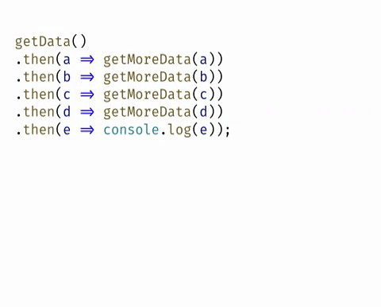

# 前端异步操作

- JavaScript 是单线程执行，避免引起同时渲染又修改 html 之类的问题；
- 排队，前面一个任务完成，再执行后面一个任务；
- 死循环，耗时较长的任务，常见的浏览器无响应（假死）。

所以 js 将任务的执行模式分为两种：同步和异步。

- 同步就是顺序执行，连续的执行
- 异步永远排在同步任务后边，不连续的执行

## html 中的文件异步加载

正常的页面解析：解析 html 文件，遇到外部文件，就执行下载线程，下载完成，按照顺序执行。

[从输入 URL 到页面加载的过程](https://dailc.github.io/2018/03/12/whenyouenteraurl.html)

- defer 与 async，`<script>`标签的属性
  - defer 延迟脚本。`<script type="text/javascript" defer="defer" src="..."></script>`，设置给 javascript 标签，**立即下载，延时执行**。
  - 异步脚本 async，onload 之前执行，告诉浏览器不需要等待脚本的下载和执行，不保证执行顺序。
- 文件加载与页面解析，同时加载 6 个资源
- js 延时加载文件，懒加载，使用 js 来生成标签来加载资源
- [worker，子线程的概念](https://developer.mozilla.org/zh-CN/docs/Web/API/Web_Workers_API)

## js 异步操作

### setTimeout 与 setInterval

[setTimeout](https://developer.mozilla.org/zh-CN/docs/Web/API/Window/setTimeout)
[setInterval](https://developer.mozilla.org/fr/docs/Web/API/WindowTimers/setInterval)

```js
console.log(1);
setTimeout(function() {
  console.log(2);
}, 200);
console.log(3);
function longRunning() {
  console.time("longRunning");
  let counter = 0;
  const times = 1e9;
  while (counter++ < times);
  console.timeEnd("longRunning");
}
console.log(longRunning());
setTimeout(function() {
  console.log(4);
}, 0);
```

#### 改变 setTimeout 或者 setInterval 的 this 执行上下文

```js
var a = 1;
var obj = {
  a: 2,
  test: function() {
    setTimeout(function() {
      console.log(this.a);
    }, 0);
  }
};
obj.test(); //  2
var a = 1;
var obj = {
  a: 2,
  test: function() {
    setTimeout(
      function() {
        console.log(this.a);
      }.bind(this),
      0
    );
  }
};
obj.test(); //  2
var a = 1;
var obj = {
  a: 2,
  test: function() {
    setTimeout(
      function(_this) {
        console.log(_this.a);
      },
      0,
      this
    );
  }
};
obj.test(); //  2
```

### 事件

[事件](https://developer.mozilla.org/zh-CN/docs/Web/API/Document_Object_Model/Events)

### http 请求

[ajax](https://developer.mozilla.org/zh-CN/docs/Web/Guide/AJAX/Getting_Started)/[fetch](https://developer.mozilla.org/zh-CN/docs/Web/API/Fetch_API/Using_Fetch)，http 请求

### requestAnimationFrame

[requestAnimationFrame](https://developer.mozilla.org/zh-CN/docs/Web/API/Window/requestAnimationFrame)

### 读写文件，Node.js 中

剩下的都是同步处理

[查看浏览器兼容性](https://caniuse.com/#search=fetch)

## js 中异步操作的处理方式

- 回调处理模式
  - callback
  - Promise/A+
  - 生成器 Generators/yield
  - async...await
- 发布/订阅( Pub/Sub )，可以执行多个
  - [EventEmitter](http://nodejs.cn/api/events.html)
  - [rxjs](https://rxjs-cn.github.io/learn-rxjs-operators/operators/combination/combineall.html)

[ES6+文档](http://es6.ruanyifeng.com/)
实例参考[test](./test/index.html)下的html。
