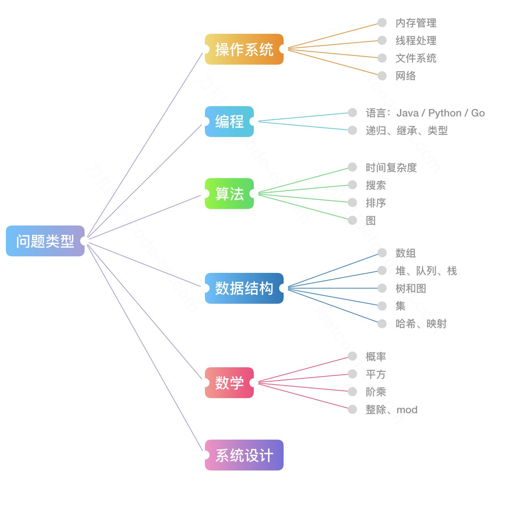

可以明确的一点是，面试算法题目在难度上（尤其是代码难度上）会略低一些，倾向于考察一些基础数据结构与算法，对于高级算法和奇技淫巧一般不作考察。

## 算法与数据结构

### 算法 - Algorithms

1. 排序算法：**快速排序**、归并排序、计数排序
2. 搜索算法：回溯、**递归**、剪枝技巧
3. 图论：**最短路**、最小生成树、网络流建模
4. 动态规划：**背包问题、最长子序列**、计数问题
5. 基础技巧：**分治**、倍增、**二分**、贪心

### 数据结构 - Data Structures

1. 数组与链表：单 / 双向链表、跳舞链
2. 栈与队列
3. 树与图：最近公共祖先、并查集
4. 哈希表堆：大 / 小根堆、可并堆
5. 字符串：字典树、后缀树

[LeetCode 探索](https://leetcode-cn.com/explore/)

## 如何刷算法题

刷题其实就是分为两步：

1. 第一步**有思路**，即知道用哪种姿势怎么解题；
2. 第二步是**实现**，即将你的思路转化为代码。

有了思路，其实把它实现出来就是自然而然的事儿了。

1. 多题一解 - 刷专题。
2. 一题多解 - 优化计算过程。

## 参考文章

[互联网公司最常见的面试算法题有哪些](https://www.zhihu.com/question/24964987/answer/586425979)，参考这里的 Top Interview Questions，分类刷题。

[leetcode 题库](https://leetcode-cn.com/problemset/all/)，很值得看一看。
