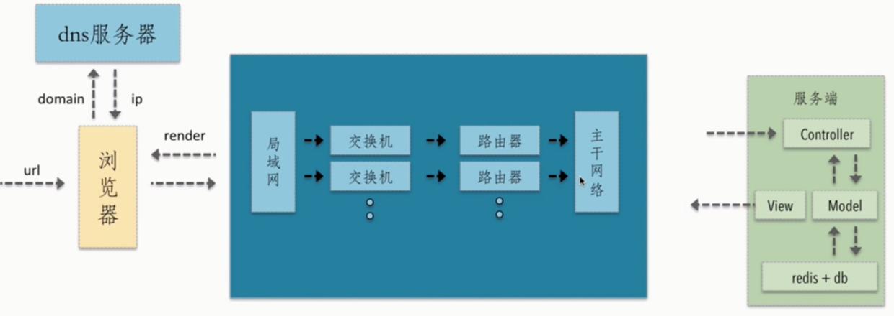

[参考文章 1：从输入 URL 到页面加载的过程](http://www.dailichun.com/2018/03/12/whenyouenteraurl.html)

[参考文章 2：从 URL 输入到页面展现到底发生什么](https://github.com/ljianshu/Blog/issues/24)

## 主要步骤如下

1. DNS 解析：将域名解析成 IP 地址，用于查找服务器；
2. TCP 连接：TCP 三次握手，发送 HTTP 请求的基础；
3. 发送 HTTP 请求：options/get/post/head/delete/update；
4. 服务器处理请求并返回 HTTP 报文；
5. 浏览器解析代码并渲染页面：domTree -> renderTree；
6. 连接结束：TCP 四次挥手；

## 主要概念

### URL

URL（Uniform Resource Locator），统一资源定位符，用于定位互联网上资源，俗称网址。

`scheme://host.domain:port/path/filename`

各部分解释如下：

- scheme - 定义因特网**服务的类型**。常见的协议有 http、https、ftp、file，其中最常见的类型是 http，而 https 则是进行加密的网络传输。
- host - 定义域主机（http 的默认主机是 www）
- domain - 定义因特网域名，比如 w3school.com.cn
- port - 定义主机上的端口号（http 的默认端口号是 80）
- path - 定义服务器上的路径（如果省略，则文档必须位于网站的根目录中）。
- filename - 定义文档/资源的名称

### DNS，域名解析

**通过 IP 查找对应的服务器**：在浏览器输入网址后，首先要经过域名解析，因为浏览器并不能直接通过域名找到对应的服务器，而是要通过 IP 地址。

#### 域名解析

DNS 协议提供通过域名查找 IP 地址，或逆向从 IP 地址反查域名的服务。DNS 是一个网络服务器，我们的域名解析简单来说就是在 DNS 上记录一条信息记录。

例如 baidu.com 220.114.23.56（服务器外网 IP 地址）80（服务器端口号）

1. 首先查找缓存：浏览器缓存 -> 操作系统缓存 -> 路由器缓存；
2. 缓存查找不到，就去 ISP 的 DNS 服务器查询：ISP 是**互联网服务提供商**(Internet Service Provider)的简称，ISP 有专门的 DNS 服务器应对 DNS 查询请求。
3. 根服务器：ISP 的 DNS 服务器**还找不到的话**，它就会向根服务器发出请求，进行递归查询（DNS 服务器先问根域名服务器.com 域名服务器的 IP 地址

## HTTP 请求分为三个部分：TCP 三次握手、http 请求响应信息、关闭 TCP 连接。

### TCP 三次握手

#### 为啥需要三次握手

为了防止**已失效的连接请求报文段**突然又传送到了服务端，因而产生错误。

### 发送 HTTP 请求

TCP 三次握手结束后，开始发送 HTTP 请求报文。
请求报文由请求行（request line）、请求头（header）、请求体三个部分组成。

请求方法包含 8 种：GET、POST、PUT、DELETE、PATCH、HEAD、OPTIONS、TRACE。
URL 即请求地址，由 <协议>：//<主机>：<端口>/<路径>?<参数> 组成
协议版本即 http 版本号。

#### 请求头包含请求的附加信息，由关键字/值对组成，每行一对，关键字和值用英文冒号“:”分隔

请求头部通知服务器有关于客户端请求的信息。它包含许多有关的**客户端环境和请求正文的有用信息**。

其中比如：Host，表示主机名，虚拟主机；

Connection,HTTP/1.1 增加的，使用 **keepalive，即持久连接**，一个连接可以发多个请求；

User-Agent，请求发出者，兼容性以及定制化需求。

## HTML 页面加载和解析流程，浏览器解析渲染页面

### 浏览器解析渲染页面，主要五个步骤

1. 根据 HTML 解析出 **DOM 树**
2. 根据 CSS 解析生成 **CSS 规则树**
3. 结合 DOM 树和 CSS 规则树，生成**渲染树**
4. 根据渲染树计算每一个节点的信息
5. 根据计算好的信息**绘制页面**

### 浏览器解析渲染页面，主要细节，reflow & repaint

#### 1. 获取 HTML 文件，根据 HTML 解析 DOM 树

1. 用户输入网址（假设是个 html 页面，并且是第一次访问），浏览器向服务器发出请求，**服务器返回 html 文件**。
2. 根据 HTML 的内容，**将标签按照结构解析成为 DOM 树**，DOM 树解析的过程是一个**深度优先遍历**。**即先构建当前节点的所有子节点，再构建下一个兄弟节点**。
3. 在读取 HTML 文档，构建 DOM 树的过程中，**若遇到 script 标签**，则 DOM 树的构建会暂停（阻塞渲染），直至脚本执行完毕。但是 css/img 不会，这就是为什么 css 在前，js 在后的原因。

#### 2. 根据 从服务器获取的 CSS 解析生成 CSS 规则树

1. 解析 CSS 规则树时 js 执行将暂停，直至 CSS 规则树就绪。
2. 浏览器在 **CSS 规则树生成之前不会进行渲染**。

#### 3. 结合 DOM 树和 CSS 规则树，生成渲染树

1. DOM 树和 CSS 规则树**全部准备好了以后，浏览器才会开始构建渲染树**。
2. 精简 CSS 并可以加快 CSS 规则树的构建，从而加快页面相应速度。

#### 4. 根据渲染树计算每一个节点的信息（布局）

1. 布局 layout：通过渲染树中渲染对象的信息，计算出每一个渲染对象的位置和尺寸
2. 回流 reflow：在布局完成后，发现了某个部分发生了变化影响了布局，那就需要**倒回去重新渲染**。

#### 5. 根据计算好的信息绘制页面

1. 绘制阶段，系统会遍历呈现树，并调用呈现器的“paint”方法，将呈现器的内容显示在屏幕上。
2. 重绘 repaint：**某个元素的背景颜色，文字颜色等，不影响元素周围或内部布局的属性**，将只会引起浏览器的重绘。
3. 回流：某个元素的**尺寸或者位置发生了变化**，则需重新计算渲染树，重新渲染。

## 断开连接，TCP 四次挥手
