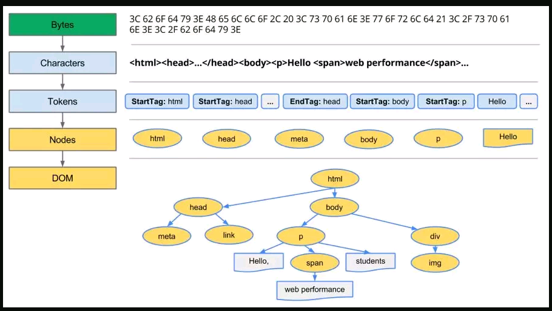

[参考文章 1：从输入 URL 到页面加载的过程](http://www.dailichun.com/2018/03/12/whenyouenteraurl.html)

[参考文章 2：从 URL 输入到页面展现到底发生什么](https://github.com/ljianshu/Blog/issues/24)

## 主要步骤如下

1. DNS 解析：将**域名解析成 IP 地址**，用于查找服务器；
2. TCP 连接：**TCP 三次握手**，发送 HTTP 请求的基础；
3. 发送 HTTP 请求：html 文件及相关的资源文件，options/get/post/head/delete/update；
4. 服务器处理请求并返回 HTTP 报文；
5. 浏览器解析代码并渲染页面：domTree+css 规则树 -> renderTree；
6. 连接结束：TCP 四次挥手；

## 主要概念

### URL

URL（Uniform Resource Locator），**统一资源定位符**，用于定位互联网上资源，俗称网址。

`scheme://host.domain:port/path/filename`

各部分解释如下：

- scheme - 定义因特网**服务的类型**。常见的协议有 http、https、ftp、file，其中最常见的类型是 http，而 https 则是进行**加密的网络传输**。
- host - 定义域主机（http 的默认主机是 www）
- domain - 定义因特网域名，比如 w3school.com.cn
- port - 定义主机上的端口号（http 的默认端口号是 80）
- path - 定义服务器上的路径（如果省略，则文档必须位于网站的根目录中）。
- filename - 定义文档/资源的名称

### DNS，域名解析

**通过 IP 查找对应的服务器**：在浏览器输入网址后，首先要经过域名解析，因为浏览器并不能直接通过域名找到对应的服务器，而是要通过 IP 地址。

#### 域名解析

DNS 协议提供通过域名查找 IP 地址，或逆向从 IP 地址反查域名的服务。

**DNS 是一个网络服务器**，我们的域名解析简单来说就是在 DNS 上记录一条信息记录。

例如 baidu.com 220.114.23.56（服务器外网 IP 地址）80（服务器端口号）

1. 首先查找缓存：浏览器缓存 -> 操作系统缓存 -> 路由器缓存；
2. 缓存查找不到，就去 ISP 的 DNS 服务器查询：ISP 是**互联网服务提供商**(Internet Service Provider)的简称，ISP 有专门的 DNS 服务器应对 DNS 查询请求。
3. 根服务器：ISP 的 DNS 服务器**还找不到的话**，它就会向根服务器发出请求，进行递归查询（DNS 服务器先问根域名服务器.com 域名服务器的 IP 地址

## HTTP 请求分为三个部分：TCP 三次握手、http 请求响应信息、关闭 TCP 连接

### TCP 三次握手

#### 为什么需要三次握手

为了防止**已失效的连接请求报文段**突然又传送到了服务端，因而产生错误。

### 发送 HTTP 请求

TCP 三次握手结束后，开始发送 HTTP 请求报文。

请求报文由请求行（request line）、请求头（header）、请求体三个部分组成。

请求方法包含 8 种：GET、POST、PUT、DELETE、PATCH、HEAD、OPTIONS、TRACE。

URL 即请求地址，由 `<协议>：//<主机>：<端口>/<路径>?<参数>` 组成
协议版本即 http 版本号。

#### 请求头包含请求的附加信息，由关键字/值对组成，每行一对，关键字和值用英文冒号“:”分隔

请求头部通知服务器有关于客户端请求的信息。它包含许多有关的**客户端环境和请求正文的有用信息**。

其中比如：Host，表示主机名，虚拟主机；

Connection,HTTP/1.1 增加的，使用 **keepalive，即持久连接**，一个连接可以发多个请求；

User-Agent，请求发出者，兼容性以及定制化需求。

## HTML 页面加载和解析流程，浏览器解析渲染页面

### 浏览器解析渲染页面，主要五个步骤

1. 根据 HTML 解析出 **DOM 树 domTree**
2. 根据 CSS 解析生成 **CSS 规则树 styleTree**
3. 结合 DOM 树和 CSS 规则树，生成**渲染树 renderTree**
4. 根据渲染树计算每一个节点的信息
5. 根据计算好的信息**绘制页面**

### 浏览器解析渲染页面，主要细节，reflow 回流（重新渲染） & repaint 重绘（局部样式绘制）

#### 1. 获取 HTML 文件，根据 HTML 解析 DOM 树

1. 用户输入网址（假设是个 html 页面，并且是第一次访问），浏览器向服务器发出请求，**服务器返回 html 文件**。
2. 根据 HTML 的内容，**将标签按照结构解析成为 DOM 树**，DOM 树解析的过程是一个**深度优先遍历**。**即先构建当前节点的所有子节点，再构建下一个兄弟节点**。
3. 在读取 HTML 文档，构建 DOM 树的过程中，**若遇到 script 标签，则 DOM 树的构建会暂停（阻塞渲染）**，直至脚本执行完毕。但是 **css/img** 不会，这就是为什么 css 在前，js 在后的原因。

#### 2. 根据 从服务器获取的 CSS 解析生成 CSS 规则树

1. 解析 CSS 规则树时 js 执行将暂停，直至 CSS 规则树就绪。
2. 浏览器在 **CSS 规则树生成之前不会进行渲染**。

#### 3. 结合 DOM 树和 CSS 规则树，生成渲染树

1. DOM 树和 CSS 规则树**全部准备好了以后，浏览器才会开始构建渲染树**。
2. 精简 CSS 并可以加快 CSS 规则树的构建，从而加快页面相应速度。

#### 4. 根据渲染树计算每一个节点的信息（布局 layout）

1. **布局 layout**：通过渲染树中渲染对象的信息，计算出每一个渲染对象的位置和尺寸；
2. 回流 reflow：在布局完成后，发现了某个部分发生了变化影响了**布局**，那就需要**倒回去重新渲染**。

#### 5. 根据计算好的信息绘制页面

1. 绘制阶段，系统会遍历呈现树，**并调用呈现器的“paint”方法**，将呈现器的内容显示在屏幕上。
2. 重绘 repaint：**某个元素的背景颜色，文字颜色等，不影响元素周围或内部布局的属性**，将只会引起浏览器的重绘。
3. 回流：某个元素的**尺寸或者位置发生了变化**，则需重新计算渲染树，重新渲染。

### reflow 重排和 repaint 重绘

reflow 重排、回流：某个元素的**尺寸或者位置发生了变化**，则需重新计算渲染树，**重新渲染**。

repaint 重绘：**某个元素的背景颜色，文字颜色等，不影响元素周围或内部布局的属性**，将只会引起浏览器的重绘。

#### 导致页面重排 reflow 的一些操作

- 内容改变
- 文本改变或图片尺寸改变
- DOM 元素的**几何属性的变化**

例如改变 DOM 元素的**宽高值**时，原渲染树中的相关节点会失效，浏览器会根据变化后的 DOM 重新排建渲染树中的相关节点。如果父节点的几何属性变化时，还会使其子节点及后续兄弟节点重新计算位置等，造成一系列的重排。

- DOM 树的结构变化

**添加 DOM 节点、修改 DOM 节点位置及删除某个节点都是对 DOM 树的更改**，会造成页面的重排。**浏览器布局是从上到下的过程，修改当前元素不会对其前边已经遍历过的元素造成影响**，但是如果在所有的节点前添加一个新的元素，则后续的所有元素都要进行重排。

- 获取某些属性

除了渲染树的直接变化，当获取一些属性值时，**浏览器为取得正确的值也会发生重排**，这些属性包括：offsetTop、offsetLeft、 offsetWidth、offsetHeight、scrollTop、scrollLeft、scrollWidth、scrollHeight、 clientTop、clientLeft、clientWidth、clientHeight、getComputedStyle()。

- 浏览器窗口尺寸改变

窗口尺寸的改变会影响整个网页内元素的尺寸的改变，即 DOM 元素的集合属性变化，因此会造成重排。

#### 导致页面重绘 repaint 的操作

- 应用新的样式或者修改任何影响**元素外观**的属性，color
- 只改变了元素的样式，并未改变元素大小、位置，此时只涉及到重绘操作。
  重排一定会导致重绘
- **一个元素的重排一定会影响到渲染树的变化，因此也一定会涉及到页面的重绘**。

## 简介版本：从浏览器地址栏输入 url 到显示页面的步骤(以 HTTP 为例)

1. 在浏览器地址栏输入 URL
2. 浏览器查看**缓存**，如果请求资源在缓存中并且可用，跳转到转码步骤
   1. 如果资源未缓存，发起新请求
   2. 如果已缓存，检验是否可用，可用直接提供给客户端，否则与服务器进行验证。
   3. 检验新鲜通常有两个 HTTP 头进行控制`Expires`和`Cache-Control`：
      - HTTP1.0 提供 Expires，值为一个绝对时间表示缓存新鲜日期
      - HTTP1.1 增加了 Cache-Control: max-age=,值为以秒为单位的最大新鲜时间
3. 浏览器**解析 URL**获取协议，主机，端口，path
4. 浏览器**组装一个 HTTP（GET）请求报文**
5. 浏览器**根据域名地址获取主机 ip 地址**，过程如下：**介绍 DNS 解析**
   1. 浏览器缓存
   2. 本机（本地）缓存
   3. hosts 文件
   4. 路由器缓存
   5. ISP DNS 缓存
   6. DNS 递归查询（可能存在负载均衡导致每次 IP 不一样）
6. **打开一个 socket 与目标 IP 地址，端口建立 TCP 链接**，三次握手如下：
   1. 客户端发送一个 TCP 的**SYN=1，Seq=X**的包到服务器端口（能不能发）
   2. 服务器发回**SYN=1， ACK=X+1， Seq=Y**的响应包（能发）
   3. 客户端发送**ACK=Y+1， Seq=Z**（发）
7. TCP 链接建立后**发送 HTTP 请求**
8. 服务器接受请求并解析，将请求转发到服务程序，如虚拟主机使用 HTTP Host 头部判断请求的服务程序
9. 服务器检查**HTTP 请求头是否包含缓存验证信息**如果验证缓存可用，返回**304**等对应状态码
10. 处理程序读取完整请求并准备 HTTP 响应，可能需要查询数据库等操作
11. 服务器将**响应报文通过 TCP 连接发送回浏览器**
12. 浏览器接收 HTTP 响应，然后根据情况选择**关闭 TCP 连接或者保留重用（keep alive），关闭 TCP 连接的四次握手如下**：
    1. 主动方发送**Fin=1， Ack=Z， Seq= X**报文
    2. 被动方发送**ACK=X+1， Seq=Z**报文
    3. 被动方发送**Fin=1， ACK=X， Seq=Y**报文
    4. 主动方发送**ACK=Y， Seq=X**报文
13. 浏览器检查**响应状态吗**：是否为 1XX，3XX， 4XX， 5XX，这些情况处理与 2XX 不同
14. 如果资源可缓存，**进行缓存**
15. 对响应进行**解码**（例如 gzip 压缩）
16. 根据资源类型决定如何处理（假设资源为 HTML 文档）
17. **解析 HTML 文档，构件 DOM 树，下载资源，构造 CSSOM 树，执行 js 脚本**，这些操作没有严格的先后顺序，以下分别解释
18. **构建 DOM 树**：
    1. **Tokenizing**：根据 HTML 规范将字符流解析为标记
    2. **Lexing**：词法分析将标记转换为对象并定义属性和规则
    3. **DOM construction**：根据 HTML 标记关系将对象组成 DOM 树
19. 解析过程中遇到图片、样式表、js 文件，**启动下载**
20. 构建**CSSOM 树**：
    1. **Tokenizing**：字符流转换为标记流
    2. **Node**：根据标记创建节点
    3. **CSSOM**：节点创建 CSSOM 树
21. **[根据 DOM 树和 CSSOM 树构建渲染树](https://developers.google.com/web/fundamentals/performance/critical-rendering-path/render-tree-construction)**:
    1. 从 DOM 树的根节点遍历所有**可见节点**，不可见节点包括：
       1. `script`,`meta`这样本身不可见的标签。
       2. 被 css 隐藏的节点，如`display: none`
    2. 对每一个可见节点，找到恰当的 CSSOM 规则并应用
    3. 发布可视节点的内容和计算样式
22. **js 解析如下**：
    1. 浏览器创建 Document 对象并解析 HTML，将解析到的元素和文本节点添加到文档中，此时**document.readystate 为 loading**
    2. HTML 解析器遇到**没有 async 和 defer 的 script 时**，将他们添加到文档中，然后执行行内或外部脚本。这些脚本会同步执行，并且在脚本下载和执行时解析器会暂停。这样就可以用 document.write()把文本插入到输入流中。**同步脚本经常简单定义函数和注册事件处理程序，他们可以遍历和操作 script 和他们之前的文档内容**
    3. 当解析器遇到设置了**async**属性的 script 时，开始下载脚本并继续解析文档。脚本会在它**下载完成后尽快执行**，但是**解析器不会停下来等它下载**。异步脚本**禁止使用 document.write()**，它们可以访问自己 script 和之前的文档元素
    4. 当文档完成解析，document.readState 变成 interactive
    5. 所有**defer**脚本会**按照在文档出现的顺序执行**，延迟脚本**能访问完整文档树**，禁止使用 document.write()
    6. 浏览器**在 Document 对象上触发 DOMContentLoaded 事件**
    7. 此时文档完全解析完成，浏览器可能还在等待如图片等内容加载，等这些**内容完成载入并且所有异步脚本完成载入和执行**，document.readState 变为 complete,window 触发 load 事件
23. **layout布局页面，显示页面**（HTML 解析过程中会逐步显示页面）

