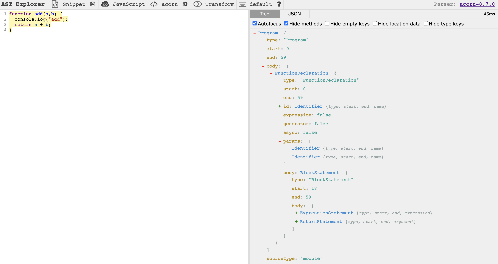
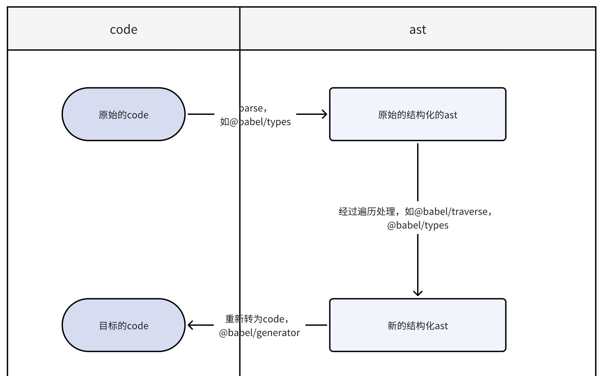
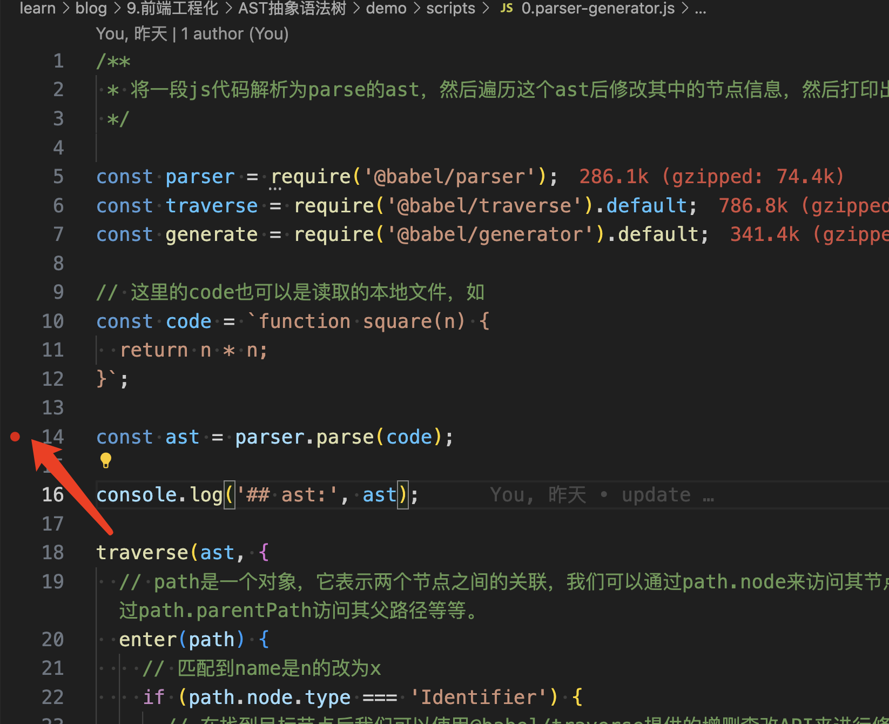
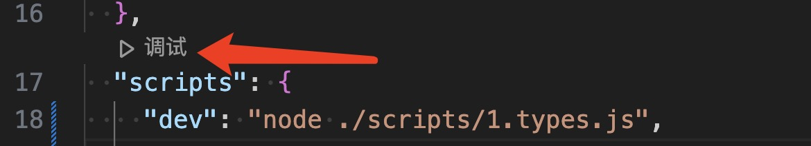

## 什么是抽象语法树 AST

AST（Abstract Syntax Tree，抽象语法树）是一种用于表示编程语言代码结构的数据结构。它是一种树形结构，其中每个节点表示代码中的一个语法元素，如变量、操作符、函数调用等等。AST 通常用于编程语言的解析、分析和转换。

AST 是编程语言中重要的数据结构，用于分析、理解和转换代码，对于编译、解释和代码分析等应用具有重要作用。

Webpack、ESLint、JSX、TypeScript 的编译和模块化规则之间的转化都是通过 AST 来实现对代码的检查、分析以及编译等操作。这样操作比直接匹配源代码操作要安全的多。

### 初识 AST

使用工具[astexplorer](https://astexplorer.net/)来查看如下代码的 ast 结构，左侧输入如下代码，在右侧可以看到对应的 ast。

```js
function add(a, b) {
  console.log('add');
  return a + b;
}
```



## AST 有什么用

以下是 AST 的一些用途：

1. 表示代码结构：AST 将代码分解为语法元素的层次结构，每个节点代表一个语法单元，例如变量、函数、条件语句等等。这有助于理解代码的结构和组织。
2. 代码转换： AST 用于将一种编程语言的代码转换为另一种编程语言的代码，或将新的语法特性转换为旧版本的代码。这在跨浏览器兼容性和代码重构中非常有用。
3. 自动化重构： 使用 AST 可以执行自动化的代码重构操作，例如变量重命名、提取函数、合并重复代码块等。
4. 代码分析：AST 可用于代码分析工具，如静态分析器、代码风格检查器和代码重构工具。这些工具可以检查代码中的问题、提供建议和进行自动重构。
5. 代码转换：开发人员可以使用 AST 来进行代码转换，例如将代码从一种编程语言转换为另一种，或者进行代码重构，以改善代码质量和可维护性。
6. IDE 功能增强：集成开发环境（IDE）可以利用 AST 来提供代码导航、自动补全、重构和代码分析等功能，以帮助开发人员更轻松地编写和维护代码。
7. 静态类型检查： 静态类型检查工具可以使用 AST 来分析代码中的类型信息，以提供类型检查和类型推断。
8. 源代码映射： 在编译器和调试工具中，AST 可用于生成源代码和转换后代码之间的映射，以便在调试时追踪原始源代码。
9. ...

## AST 怎么用

手动的去写工具对拿到的字符串代码进行分析，也是可以实现对代码的结构化修改。现在大可不必，有很多可用的工具，本次应用 babel 来对做一些基础的操作，验证相关模块的一些功能。

为了使用 AST，你需要以下步骤：

1. 解析：使用解析器将源代码解析成 AST，即生成一个 JSON 对象。在 JavaScript 中，`@babel/parser` 是一个常用的解析器。
2. 遍历：遍历 AST 树以查找或修改节点。你可以使用 AST 遍历器，如`@babel/traverse`，来帮助遍历 AST 树。
3. 分析和修改：根据你的需求，执行分析、修改或其他操作。你可以识别特定类型的节点，读取属性，执行条件检查，并修改节点，如`@babel/types`。
4. 生成：将修改后的 AST 节点重新生成为代码。你可以使用代码生成器，如`@babel/generator`，将 AST 节点转换回代码。

在实际项目中，AST 通常与编程语言的语法规则和特性相关联。你可以根据项目的需求选择适合的工具和库来处理 AST。

基本的思路参考如下的路线：



### babel 介绍

1. Babel 是一个 JavaScript 编译器；
2. Babel 是一个工具链，主要用于将采用 ECMAScript 2015+ 语法编写的代码转换为向后兼容的 JavaScript 语法，以便能够运行在当前和旧版本的浏览器或其他环境中。
3. 当然我们这里不关心 js 代码的转换问题，主要要使用 babel 工具，对代码进行分析处理；

### babel 常用工具

Babel 是一个广泛用于 JavaScript 代码转换和编译的工具链，它允许开发者将最新版本的 JavaScript 代码转换为向后兼容的旧版本，以确保在不同环境中运行。以下是一些常用的 Babel 工具和插件：

1. @babel/core： `@babel/core` 是 Babel 工具链的核心模块，它提供了核心的编译功能。通常，你需要将它作为 Babel 插件和工具的依赖；
2. @babel/cli： `@babel/cli` 是一个命令行工具，允许你使用命令行界面运行 Babel 转换。它通常用于将整个项目中的文件或文件夹转换为兼容的代码；
3. @babel/parser： 可以把源码转换成 AST；
   1. babel 之前的版本是直接调用了 [recast](https://www.npmjs.com/package/recast) 库，来生成的 AST。现在的 @babel/parser 很大程度借鉴了 acorn。
4. @babel/traverse： 用于对 AST 的遍历，维护了整棵树的状态，并且负责替换、移除和添加节点；
5. @babel/generate： 可以把 AST 生成源码，**同时生成 sourcemap**；
6. @babel/types： 用于 AST 节点的 Lodash 式工具库, 它包含了构造、验证以及变换 AST 节点的方法，对编写处理 AST 逻辑非常有用；
7. @babel/template：**可以简化 AST 的创建逻辑**；
8. @babel/code-frame： 可以打印代码位置。

## parser-generator

`@babel/parser` 是 Babel 工具链中的一个核心模块，用于将 JavaScript 代码解析成抽象语法树（AST）。`@babel/parser` 将源代码分析为 AST，从而使得开发者能够在代码层面进行分析、转换和修改。

`@babel/generator` 是 Babel 工具链中的一个核心模块，用于将抽象语法树（AST）转换回 JavaScript 代码。它的主要功能是将修改后的或经过转换的 AST 节点重新生成为可执行的 JavaScript 代码。@babel/generator 在将 AST 转换为代码时，**可以根据配置进行缩进、添加分号等格式化操作**，以生成美观的代码。

这里是一组相对应的操作。

基础用法，参考如下的代码，[源代码地址](https://github.com/qiuwww/blog/blob/918aadf2353e21afb34da51500d451d03af074d4/9.%E5%89%8D%E7%AB%AF%E5%B7%A5%E7%A8%8B%E5%8C%96/AST%E6%8A%BD%E8%B1%A1%E8%AF%AD%E6%B3%95%E6%A0%91/demo/scripts/0.parser-generator.js)：

```js
/**
 * 将一段js代码解析为parse的ast，然后遍历这个ast后修改其中的节点信息，然后打印出来
 */

const parser = require('@babel/parser');
const traverse = require('@babel/traverse').default;
const generate = require('@babel/generator').default;

// 这里的code也可以是读取的本地文件，如
const code = `function square(n) {
  return n * n;
}`;

const ast = parser.parse(code);

console.log('## ast:', ast);

traverse(ast, {
  // path是一个对象，它表示两个节点之间的关联，我们可以通过path.node来访问其节点属性、通过path.parentPath访问其父路径等等。
  enter(path) {
    // 匹配到name是n的改为x
    if (path.node.type === 'Identifier') {
      // 在找到目标节点后我们可以使用@babel/traverse提供的增删查改API来进行修改。
      if (path.node.name === 'n') {
        path.node.name = 'x';
      }
    }
  },
});

console.log('## code res:', generate(ast, {}).code);
```

### 分析 AST 树的结构

```js
function add(a, b) {
  console.log('add');
  return a + b;
}
```

转换上边的函数的代码，会得到如下的 ast 结构：

```json
{
  "type": "Program",
  "start": 0,
  "end": 59,
  "body": [
    {
      "type": "FunctionDeclaration",
      "start": 0,
      "end": 59,
      "id": {
        "type": "Identifier",
        "start": 9,
        "end": 12,
        "name": "add"
      },
      "expression": false,
      "generator": false,
      "async": false,
      "params": [
        {
          "type": "Identifier",
          "start": 13,
          "end": 14,
          "name": "a"
        },
        {
          "type": "Identifier",
          "start": 15,
          "end": 16,
          "name": "b"
        }
      ],
      "body": {
        "type": "BlockStatement",
        "start": 18,
        "end": 59,
        "body": [
          {
            "type": "ExpressionStatement",
            "start": 22,
            "end": 41,
            "expression": {
              "type": "CallExpression",
              "start": 22,
              "end": 40,
              "callee": {
                "type": "MemberExpression",
                "start": 22,
                "end": 33,
                "object": {
                  "type": "Identifier",
                  "start": 22,
                  "end": 29,
                  "name": "console"
                },
                "property": {
                  "type": "Identifier",
                  "start": 30,
                  "end": 33,
                  "name": "log"
                },
                "computed": false,
                "optional": false
              },
              "arguments": [
                {
                  "type": "Literal",
                  "start": 34,
                  "end": 39,
                  "value": "add",
                  "raw": "\"add\""
                }
              ],
              "optional": false
            }
          },
          {
            "type": "ReturnStatement",
            "start": 44,
            "end": 57,
            "argument": {
              "type": "BinaryExpression",
              "start": 51,
              "end": 56,
              "left": {
                "type": "Identifier",
                "start": 51,
                "end": 52,
                "name": "a"
              },
              "operator": "+",
              "right": {
                "type": "Identifier",
                "start": 55,
                "end": 56,
                "name": "b"
              }
            }
          }
        ]
      }
    }
  ],
  "sourceType": "module"
}
```

这里边有很多的属性：

1. type：AST 节点的类型，后续在 `@babel/types` 部分会说明节点的判断与生成；
2. "start" 和 "end"：是用于表示源代码中节点位置的属性。这些属性记录了节点在源代码中的起始位置（开始位置）和结束位置（结束位置），以字符索引的形式表示；
   1. 这里的位置，会计算换行与空格，都被作为一个字符计算了位置；
3. "id" 通常表示标识符（Identifier），**它代表了代码中的变量名、函数名或其他标识符名称**。标识符节点包含了标识符的名称以及有关该标识符的其他信息；
4. "argument" 是一个常见的属性，通常用于表示函数调用（Call Expression）或其他操作的参数。参数是传递给函数、方法或操作的值或表达式；
5. ...

# @babel/types 介绍

@babel/types 是 Babel 工具链中的一个**核心模块**，用于创建、操作和检查抽象语法树（AST）节点。AST 节点是表示 JavaScript 代码结构的树状数据结构的元素。@babel/types 模块提供了一组方法，使得开发者能够以编程方式创建、修改和分析 AST 节点，从而实现自定义的代码转换和分析逻辑。

[参考文档:https://babeljs.io/docs/babel-types](https://babeljs.io/docs/babel-types)

[参见示例](https://github.com/qiuwww/blog/blob/918aadf2353e21afb34da51500d451d03af074d4/9.%E5%89%8D%E7%AB%AF%E5%B7%A5%E7%A8%8B%E5%8C%96/AST%E6%8A%BD%E8%B1%A1%E8%AF%AD%E6%B3%95%E6%A0%91/demo/scripts/1.types.js)

示例代码，演示 ast 的遍历及修改操作：

```js
/**
 * 更多参考types的test部分
 */
const fs = require('fs');
const parser = require('@babel/parser');
const traverse = require('@babel/traverse').default;
const types = require('@babel/types');
const generate = require('@babel/generator').default;
const { parse } = require('@babel/parser');
const t = types;

/**
 * 生成一些基本你的类型
 */
// 生成一个字符串
const strAst = types.stringLiteral('hello world');
console.log('生成一个string节点：', strAst, generate(strAst).code);

const numAst = types.numericLiteral(10e9);
console.log('生成一个数值节点：', numAst, generate(numAst).code);

const bolAst = types.booleanLiteral(0.5 > Math.random());
console.log('生成一个boolean类型节点：', bolAst, generate(bolAst).code);

const regExpAst = types.regExpLiteral('\\d.jsx?$', 'ig');
console.log('生成一个regexp节点：', regExpAst, generate(regExpAst).code);

// 生成一段语句 var str = hello world!
// 这里的var可以直接修改为const/let
const statementAst = types.variableDeclaration('var', [
  types.variableDeclarator(types.identifier('str'), types.stringLiteral('hello world!')),
]);
console.log('生成一个语句：', statementAst, '\n', generate(statementAst).code);

// c，只是定义的变量，并没有声明和赋值
const identifier = t.identifier('c');

console.log('生成一个定义节点identifier：', identifier, generate(identifier).code);

// 生成一个计算语句
const expressAst = t.assignmentExpression('+', types.identifier('a'), types.identifier('b'));
console.log('生成一个计算语句：', expressAst, generate(expressAst).code);

/**
 * 生成一个对象
  {
    a: {
      b: "foo"
    }
  }
 */
const obj = t.objectExpression([
  t.objectProperty(
    t.identifier('a'),
    t.objectExpression([t.objectProperty(t.identifier('b'), t.stringLiteral('foo'))]),
  ),
]);
console.log('obj：', obj, '\n', generate(obj).code);

/**
 * 生成一个数组
 */

const arr = types.arrayExpression([
  types.stringLiteral('string'),
  types.booleanLiteral(0.5 > Math.random()),
  types.numericLiteral(10e2),
  types.regExpLiteral('\\.jsx?$', 'g'),
  obj,
]);

console.log('arr：', arr, '\n', generate(arr).code);

/**
 * 生成一个函数
 */

// arrowFunctionExpression肩头函数使用这个类型

const funcAst = types.functionDeclaration(
  types.identifier('func'),
  [types.identifier('a'), types.identifier('b')],
  types.blockStatement([
    types.expressionStatement(
      types.callExpression(types.identifier('console.log'), [
        types.identifier('a'),
        types.identifier('b'),
      ]),
    ),
    // 这里返回return a + b;
    // t.assignmentExpression(operator, left, right)
    types.returnStatement(
      t.assignmentExpression('+', types.identifier('a'), types.identifier('b')),
    ),
  ]),
);

console.log('funcAst：', funcAst, '\n', generate(funcAst).code);

/**
 * 生成一个class并添加属性和方法
 */

// t.classDeclaration(id, superClass, body, decorators);
const classAst = types.classDeclaration(
  types.identifier('Person'),
  null,
  types.classBody([
    // t.classMethod(kind, key, params, body, computed, static, generator, async);
    types.classMethod(
      'constructor',
      t.identifier('constructor'),
      [types.identifier('name')],
      t.blockStatement([
        // t.expressionStatement(expression);
        types.expressionStatement(
          // t.assignmentExpression(operator, left, right);
          types.assignmentExpression(
            '=',
            // t.memberExpression(object, property, computed, optional);
            types.memberExpression(t.thisExpression(), t.identifier('name')),
            types.identifier('name'),
          ),
        ),
      ]),
    ),

    types.classMethod(
      'method',
      t.identifier('getName'),
      [],
      t.blockStatement([
        t.returnStatement(t.memberExpression(t.thisExpression(), t.identifier('name'))),
      ]),
    ),
  ]),
);

console.log('classAst:', classAst, generate(classAst).code);

// 打印结果
// class Person {
//   constructor(name) {
//     this.name = name;
//   }
//   getName() {
//     return this.name;
//   }
// }

/**
 * 节点是否相等、是否是目标类型
 */
const isNodesEquivalent = t.isNodesEquivalent(parse('1 + 1'), parse('1+1'));
const parseAdd = parse('1 + 1');

console.log('isNodesEquivalent：', isNodesEquivalent, parseAdd, generate(parseAdd).code);

const isCompatTag = t.react.isCompatTag('div');
console.log('isCompatTag：', isCompatTag);
```

## types 的能力

在 ast 中，不能直接使用 js 增删改查，需要将类型转为 ast 之后才能用在 ast 树之上，

1. 创建节点（Node Creation），生成一些基本的类型：
   1. `t.identifier("c")`，声明一个变量 c；
   2. `t.stringLiteral("hahaha")`，生成一个直接量字符串"hahaha"；
   3. `types.numericLiteral(10)`，直接量数值 10；
   4. `t.objectProperty(t.identifier("c"),t.arrayPattern([t.identifier("value")]),)`，给对象定义属性；
   5. 返回语句`t.isReturnStatement(node, opts)`；
   6. 生成计算语句`t.assignmentExpression(operator, left, right)`；
   7. 使用 `t.expressionStatement(node)` 可以将一个节点包装成表达式语句；
   8. ...
   9. 根据文档描述去生成复杂的节点也都是可行的：
      1. 如`t.arrowFunctionExpression(params, body, async);`用来生成一个函数，通过参数的描述我们可以找到参数的类型，然后再根据类型找到生成的方法；
         1. params: `Array<Identifier | Pattern | RestElement> (required)`；
         2. body：`BlockStatement | Expression (required)`；
            1. `BlockStatement：t.blockStatement(body, directives);`；
               1. body: `Array<Statement> (required)`；
         3. async: `boolean (default: false)`；
2. 节点检查和比较（Node Checking and Comparison）：
   1. 使用 `t.isIdentifier(node)` 来检查节点是否为标识符；
   2. 使用 `t.isFunctionDeclaration(node)` 来检查节点是否为函数声明；
   3. `t.isArrayExpression` 方法，用于检查给定的 AST 节点是否为数组表达式（Array Expression）。数组表达式通常表示 JavaScript 中的数组字面量；
   4. `t.react.isCompatTag("div")`，用于检查给定的标签名是否是 React 中的内置标签（如 "div"、"span" 等）。这个方法通常用于确定是否可以将某个标签名作为 React 组件的标签名使用；
   5. ...
3. 节点操作和修改（Node Manipulation and Modification），你可以使用 @babel/types 来操作和修改 AST 节点；
   1. 你可以使用 `t.cloneNode(node)` 复制节点；
   2. 使用 `t.removeComments(node)` 删除注释；
   3. 使用 `t.isAssignmentExpression(node)` 检查是否为赋值表达式等。
   4. ...

```js
const t = require('@babel/types');

// 函数节点
const identifier = t.identifier('myVariable');
const stringLiteral = t.stringLiteral('Hello, world!');
const functionDeclaration = t.functionDeclaration(
  t.identifier('myFunction'),
  [],
  t.blockStatement([]),
);

// 检测变量的声明类型

// 创建一个 let 变量声明节点
const letVariableDeclaration = t.variableDeclaration('let', [
  t.variableDeclarator(t.identifier('myVariable'), null),
]);

// 类型检查
const node = t.identifier('myVariable');
console.log(t.isIdentifier(node)); // true
console.log(t.isFunctionDeclaration(node)); // false

// 节点update
const node2 = t.identifier('myVariable');
const clonedNode = t.cloneNode(node2);
const modifiedNode = t.updateIdentifier(node2, 'newVariableName');

// 检查节点是否为 VariableDeclaration
if (t.isVariableDeclaration(letVariableDeclaration)) {
  // 进一步检查是否为 let 变量声明
  if (letVariableDeclaration.kind === 'let') {
    console.log('This is a let variable declaration.');
  } else {
    console.log('This is not a let variable declaration.');
  }
} else {
  console.log('This is not a variable declaration.');
}

// t.isArrayExpression
// 创建一个数组表达式节点
const arrayExpression = t.arrayExpression([
  t.stringLiteral('item1'),
  t.stringLiteral('item2'),
  t.stringLiteral('item3'),
]);

// 检查节点是否为数组表达式
if (t.isArrayExpression(arrayExpression)) {
  console.log('This is an array expression.');
} else {
  console.log('This is not an array expression.');
}

// t.react.isCompatTag
const tagName = 'div';

if (t.react.isCompatTag(tagName)) {
  console.log(`${tagName} is a valid React tag.`);
} else {
  console.log(`${tagName} is not a valid React tag.`);
}
```

## 常见的 AST 节点类型

1. Literal（字面量）；
   1. 数字字面量 NumericLiteral；
   2. 布尔字面量 BooleanLiteral；
   3. 字符串字面量 StringLiteral；
   4. 正则表达式字面量 RegExpLiteral；
2. Identifier（标识符），Identifier 是标识符的意思，变量名、属性名、参数名等各种声明和引用的名字，都是 Identifier；
3. BinaryExpression（二元表达式）： 用于表示二元运算表达式，如加法、减法、乘法等。例如，`x + y`、`a \* b`；
4. UnaryExpression（一元表达式）： 用于表示一元运算表达式，如取反、递增、递减等。例如，`!x`、`++i`；
5. AssignmentExpression（赋值表达式）： 用于表示赋值操作，将右侧表达式的值赋给左侧标识符。例如，`x = 42`、`y += 10`；
6. FunctionDeclaration（函数声明）： 用于表示函数的声明，包括函数名、参数和函数体。例如，`function add(x, y) { return x + y; }`；
7. CallExpression（函数调用）： 用于表示函数的调用，包括被调用的函数和传递给函数的参数。例如，`add(3, 4)`；
8. Statement，ExpressionStatement（表达式语句）：
   1. statement 是语句，它是可以独立执行的单位，比如 break，continue，debugger，return 或者 if 语句、while 语句、for 语句，还有声明语句，表达式语句等。我们写的每一条可以独立执行的代码，都是语句。
   2. 语句末尾一般会加一个分号分隔，或者用换行分隔。
   3. 语句是代码执行的最小单位，可以说，代码是由语句（Statement）构成的。
9. Declaration，声明语句是一种特殊的语句，它执行的逻辑是在作用域内声明一个变量、函数、class、import、export 等；
   1. 声明语句用于定义变量，变量声明也是代码中一个基础的部分。
10. Class：
    1. class 的语法比较特殊，有专门的 AST 节点来表示。
    2. 整个 class 的内容是 ClassBody，属性是 ClassProperty，方法是 ClassMethod（通过 kind 属性来区分是 constructor 还是 method）。
11. Modules：
    1. es module 是语法级别的模块规范，所以也有专门的 AST 节点。
12. Program & Directive：
    1. program 是代表整个程序的节点，它有 body 属性代表程序体，存放 statement 数组，就是具体执行的语句的集合。还有 directives 属性，存放 Directive 节点，比如"use strict" 这种指令会使用 Directive 节点表示。
    2. Program 是包裹具体执行语句的节点，而 Directive 则是代码中的指令部分。
13. File & Comment：
    1. babel 的 AST 最外层节点是 File，它有 program、comments、tokens 等属性，分别存放 Program 程序体、注释、token 等，是最外层节点。
    2. 注释分为**块注释和行内注释**，对应 CommentBlock 和 CommentLine 节点。

## @babel/traverse 介绍

可以对 ast 数据进行遍历和修改。参照 ast 的 json 结构进行遍历修改，类似 dom 树的修改，增删改查操作都很方便。

[参考文档:https://babeljs.io/docs/babel-traverse](https://babeljs.io/docs/babel-traverse)

[参见示例](https://github.com/qiuwww/blog/blob/918aadf2353e21afb34da51500d451d03af074d4/9.%E5%89%8D%E7%AB%AF%E5%B7%A5%E7%A8%8B%E5%8C%96/AST%E6%8A%BD%E8%B1%A1%E8%AF%AD%E6%B3%95%E6%A0%91/demo/scripts/2.traverse.js)

示例代码，演示 ast 的遍历及修改操作：

```js
// 增删改查，似乎都是可以了
const { parse } = require('@babel/parser');
const generate = require('@babel/generator').default;
const fs = require('fs');
const path = require('path');
const types = require('@babel/types');
const traverse = require('@babel/traverse').default;

// 1. 读取js文件
const code = fs.readFileSync(path.resolve(__dirname, './input/demo1.jsx'), 'utf8').toString();

// 2. 将字符串转为ast
const ast = parse(code, {
  sourceType: 'module',
  // 例如添加"jsx"这个plugins后就可以解析jsx代码，不添加上边的代码就会报错
  plugins: ['jsx'],
});

// 存入到本地文件
fs.writeFileSync(__dirname + '/output/demo1-before-traverse.json', JSON.stringify(ast));

// 3. 遍历操作节点
traverse(ast, {
  // path是一个对象，它表示两个节点之间的关联，我们可以通过path.node来访问其节点属性、通过path.parentPath访问其父路径等等。
  // 这里的enter会多次进入，每个自己点都会经过这个地方
  enter(path) {
    // console.log('## enter', path.node);
    // 可以打印出来相关的节点
    const { node } = path;
    // 修改变量定义为a｜func的变量为目标的name
    if (path.isIdentifier({ name: 'a' })) {
      path.node.name = 'b';
    }
    if (path.isIdentifier({ name: 'func' })) {
      path.node.name = 'myFunc';
    }
    // 修改span标签为div
    if (path.isJSXIdentifier({ name: 'span' })) {
      path.node.name = 'div';
    }
  },

  exit(path) {
    // console.log('## exit');
  },

  // 表示程序的入口，整体，如果想要层次的便利整个ast树，就从这里开始
  // 只会进入一次
  Program(path) {
    // console.log('## Program');
    const { node } = path;

    node.body.forEach((item, index) => {
      // 在var num = 123; 声明语句后边添加一条声明语句
      if (types.isVariableDeclaration(item)) {
        let targetIndex = -1;
        if (item.kind !== 'var') {
          return;
        }
        // 查找目标语句
        item.declarations.some((_item) => {
          if (_item.id.name === 'num' && _item.init.value === 123) {
            targetIndex = index;
            return true;
          }
          return false;
        });

        // 在其后添加一条变量声明
        if (targetIndex > -1) {
          const astNode = types.variableDeclaration('var', [
            types.variableDeclarator(
              types.identifier('helloworld'),
              types.stringLiteral('Hello World'),
            ),
          ]);

          node.body.splice(targetIndex + 1, 0, astNode);
        }
      }
    });
  },

  // 所有定义的类型，包括函数定义，变量定义，类定义等
  // 与path.isIdentifier()一个意思
  Identifier(path) {
    // console.log('## Identifier', path.node);
  },

  JSXText(path) {
    // console.log('## JSXText');
  },

  ClassBody(path) {
    // console.log('## ClassBody');
  },
  CallExpression(path) {
    // console.log('## CallExpression');
  },

  FunctionDeclaration(path) {
    if (path.node.id.name === 'func') {
      // console.log('## FunctionDeclaration', path.node);
      // 给目标函数添加一条返回值
      path.node.body.body.push(types.returnStatement(types.identifier('a')));
    }
  },
});

const output = generate(ast, {}).code;

fs.writeFileSync(__dirname + '/output/demo1-after-traverse.js', output);
```

### traverse 可以有哪些选项

1. enter 和 exit 钩子函数：
   1. 你可以通过指定 enter 和 exit 钩子函数来自定义遍历过程中节点的处理。这些钩子函数允许你在进入和退出节点时执行自定义操作；
   2. 自己遍历所有的节点，然后判断节点类型，查找目标节点。
2. 行为限制的属性设置：
   1. noScope：当设置为 true 时，遍历过程中将不会创建或进入作用域。这可以用于禁用默认的作用域行为；
   2. bindings：自定义绑定。你可以传递一个包含自定义绑定的对象，以在遍历过程中替换默认绑定。作用域环境对象中包含了变量绑定（bindings）的信息，绑定指的是变量名和变量值之间的关联。绑定信息可以用于识别变量的声明和引用，以及确定变量的作用域；
   3. ...
3. 直接指定遍历某些类型，这些类型可以通过如下方式拿到：
   1. File 文件 (顶层节点包含 Program)；
   2. Program 整个程序节点 (包含 body 属性代表程序体)；
   3. Directive 指令 (例如 "use strict")；
   4. Comment 代码注释；
   5. Statement 语句 (可独立执行的语句)；
   6. Literal 字面量 (基本数据类型、复杂数据类型等值类型)；
   7. Identifier 标识符 (变量名、属性名、函数名、参数名等)；
   8. Declaration 声明 (变量声明、函数声明、Import、Export 声明等)；
   9. Specifier 关键字 (ImportSpecifier、ImportDefaultSpecifier、ImportNamespaceSpecifier、ExportSpecifier)；
   10. Expression 表达式，包括运算及赋值等操作；
   11. ClassBody，class 的 body；
   12. FunctionDeclaration 函数声明；

```js
const bindings = {
  // 自定义绑定
};

traverse(ast, {
  noScope: true,
  bindings,
  // 其他选项...
  enter(path) {
    // 进入节点时的处理
  },
  exit(path) {
    // 退出节点时的处理
  },
  Program(path) {
    // 根节点进入，只会走一次
  },
  FunctionDeclaration(path) {
    // 处理函数声明，可能会走多次
  },
  Identifier(path) {
    // 处理函数声明，可能会走多次
  },
  VariableDeclaration(path) {
    // 变量声明类型
    if (path.node.kind === 'const') {
      path.node.kind = 'let'; // 将 const 改为 let
    }
  },
});
```

### path 属性

这个主要包括当前节点的一些信息，不同的几点，这里的 path 的属性也不一样，具体可以看一下 ast 打印的结果。

```js
path {
    // 属性：
    node // 当前 AST 节点
    parent // 父 AST 节点
    parentPath // 父 AST 节点的 path
    scope // 作用域
    hub // 可以通过 path.hub.file 拿到最外层 File 对象， path.hub.getScope 拿到最外层作用域，path.hub.getCode 拿到源码字符串
    container // 当前 AST 节点所在的父节点属性的属性值
    key // 当前 AST 节点所在父节点属性的属性名或所在数组的下标
    listKey // 当前 AST 节点所在父节点属性的属性值为数组时 listkey 为该属性名，否则为 undefined
    // 方法：
    get(key) // 获取某个属性的 path
    set(key, node) // 设置某个属性
    is 类型(opts) // 判断当前节点是否是某个类型
    find(callback) // 从当前节点一直向上找到根节点(包括自己)
    findParent(callback) // 从当前节点一直向上找到根节点(不包括自己)
    insertBefore(nodes) // 在之前插入节点
    insertAfter(nodes) // 在之后插入节点
    replaceWith(replacement) // 用某个节点替换当前节点
    replaceWithMultiple(nodes) // 用多个节点替换当前节点
    replaceWithSourceString(replacement) // 把源代码转成 AST 节点再替换当前节点
    remove() // 删除当前节点
    traverse(visitor, state) // 遍历当前节点的子节点, 第 1 个参数是节点，第 2 个参数是用- 来数据的状态
    skip() // 跳过当前节点子节点的遍历
    stop() // 结束所有的遍历
    getSibling(key) // 获取某个下标的兄弟节点
    getNextSibling() // 获取下一个兄弟节点
    getPrevSibling() // 获取上一个兄弟节点
    getAllPrevSiblings() // 获取之前的所有兄弟节点
    getAllNextSiblings() // 获取之后的所有兄弟节点
}
```

#### 作用域环境对象 Scope

Babel 的 @babel/traverse 模块中引入了一个作用域环境对象，用于表示代码的作用域结构。这个作用域环境对象包含了当前作用域内的变量绑定信息，以及与作用域相关的其他信息。

- **scope.bindings**当前作用域内声明所有变量
- **scope.path**生成作用域的节点对应的路径
- **scope.references**所有的变量引用的路径
- getAllBindings() 获取从当前作用域一直到根作用域的集合
- **getBinding(name)**从当前作用域到根使用域查找变量
- getOwnBinding(name) 在当前作用域查找变量
- parentHasBinding(name, noGlobals) 从当前父作用域到根使用域查找变量
- removeBinding(name) 删除变量
- hasBinding(name, noGlobals) 判断是否包含变量
- **moveBindingTo(name, scope)**把当前作用域的变量移动到其它作用域中
- generateUid(name) 生成作用域中的唯一变量名, 如果变量名被占用就在前面加下划线
- scope.dump() 打印自底向上的 作用域与变量信息到控制台

## 借助 vscode 调试 node 代码

在浏览器运行的代码，通过打断点或者 debugger、console 打印的方式，很容易的就可以知道其运行过程中的状态。

在 node 环境下借助 vscode 同样可以实现对代码进行断点调试，相对于 console 的方式会高效很多。

### 具体说明自己常用的调试方法

1. 添加 npm.scripts 执行命令；
2. 添加断点的位置；
   1. 就是在左侧点一下，就会出现一个小圆点，这里需要添加了上边的 scripts 命令后才会出现；
3. 选择 debug 运行；





具体参考：[AST 抽象语法树/demo](https://github.com/qiuwww/blog/blob/0197d15032d57eeeada98e8e29475aedeb026dfb/9.%E5%89%8D%E7%AB%AF%E5%B7%A5%E7%A8%8B%E5%8C%96/AST%E6%8A%BD%E8%B1%A1%E8%AF%AD%E6%B3%95%E6%A0%91)。

## 总结

分析 babel，可以更加深刻的理解 js 的执行原理。

这些都是 webpack 插件与 loader 开发、语法检查的基础，可以方便的去开发插件实现自己对于代码的处理。

通过对以上的学习，可以让我开发一些基本的插件，如将代码中的函数进行形式的转换，[参见代码](https://github.com/qiuwww/blog/blob/918aadf2353e21afb34da51500d451d03af074d4/9.%E5%89%8D%E7%AB%AF%E5%B7%A5%E7%A8%8B%E5%8C%96/AST%E6%8A%BD%E8%B1%A1%E8%AF%AD%E6%B3%95%E6%A0%91/demo/scripts/%E4%BB%A3%E7%A0%81%E8%BD%AC%E6%8D%A2%E6%8F%92%E4%BB%B6_plugin-transform-arrow-functions.js)。

通过对肩头函数结构的调整，就可以实现形式的转变，当然实际情况是要比这复杂很多的。

## 参考

1. [玩转 ast- 手写 babel 插件篇](https://juejin.cn/post/7179481462050127931#heading-9)；
2. [JavaScript 常见 AST 梳理](https://blog.csdn.net/weixin_40906515/article/details/118004822)；
3. [应用 ast 抽象语法树修改 js 函数](https://blog.csdn.net/qq_18470967/article/details/119964180)；
4. [手把手带你入门 AST 抽象语法树](https://juejin.cn/post/6844904035271573511)；
5. [acorn](https://github.com/acornjs/acorn)；
6. [Babel AST 代码转换、生成](https://blog.csdn.net/weixin_43294560/article/details/125443800)；
7. [Babel 源码解析之@babel/core](https://juejin.cn/post/7041068341754069006/)；
8. [带你玩转 babel 工具链（二）@babel/traverse](https://juejin.cn/post/7113800415057018894)；
9. [@babel/types 深度应用](https://juejin.cn/post/6984945589859385358#heading-7)；
10. [JavaScript 常见 AST 梳理](https://blog.csdn.net/weixin_40906515/article/details/118004822)
