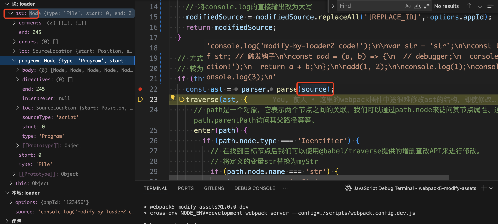
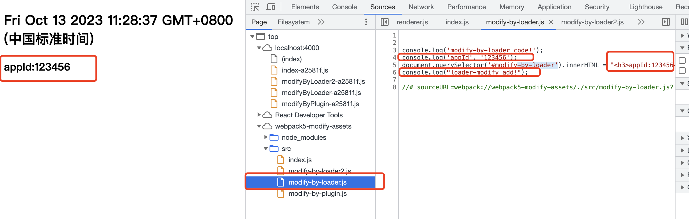

## 开发 loader 来修改代码输出

使用 loader 来修改源代码，比较靠近源代码，处理比较靠前，是很方便的。

### [开发一个 loader 的基本步骤](https://webpack.docschina.org/contribute/writing-a-loader/)

loader 的串行处理类似于一个管道，后边的拿到前面传递的字符串结果，经处理后，继续传递个后边的 loader。

```js
// my-custom-loader.js
module.exports = function (source) {
  // 你的loader逻辑将在这里
  let modifiedSource = source;
  // 你可以使用正则表达式、字符串替换、AST转换等方法来修改源代码。
  // ...
  return modifiedSource;
};
```

### 本示例中的 loader

**原始代码**：

```js
// webpack5-modify-assets/src/modify-by-loader.js
console.log('modify-by-loader code!');

console.log('appId', '[REPLACE_ID]');

document.querySelector('#modify-by-loader').innerHTML = `<h3>appId:[REPLACE_ID]</h3>`;

// webpack5-modify-assets/src/modify-by-loader2.js
console.log('modify-by-loader2 code!');

var str = 'str';

const typeA = typeof str; // 触发钩子

const add = (a, b) => {
  // debugger;
  console.log('add function!');
  return a + b;
};

add(1, 2);

console.log(1);
console.log(2);
console.log(3);
```

**经 loader 处理**：

```js
// webpack5-modify-assets/scripts/loader-modify.js

const { getOptions } = require('loader-utils');
const parser = require('@babel/parser');
const traverse = require('@babel/traverse').default;
const generate = require('@babel/generator').default;
const types = require('@babel/types');

module.exports = function loader(source) {
  const options = getOptions(this);
  // 方式一
  // 判断目标文件，并直接修改code
  if (this.resourcePath.endsWith('src/modify-by-loader.js')) {
    // 直接修改js字符串代码
    let modifiedSource = `${source} \n console.log("loader-modify add!");`;
    // 将console.log的直接输出改为大写
    modifiedSource = modifiedSource.replaceAll('[REPLACE_ID]', options.appId);
    return modifiedSource;
  }

  // 方式二
  // 转为ast处理后再转为code
  if (this.resourcePath.endsWith('src/modify-by-loader2.js')) {
    const ast = parser.parse(source);
    traverse(ast, {
      // path是一个对象，它表示两个节点之间的关联，我们可以通过path.node来访问其节点属性、通过path.parentPath访问其父路径等等。
      enter(path) {
        if (path.node.type === 'Identifier') {
          // 在找到目标节点后我们可以使用@babel/traverse提供的增删查改API来进行修改。
          // 将定义的变量str替换为myStr
          if (path.node.name === 'str') {
            path.node.name = 'myStr';
          }
        }
      },

      // 匹配肩头函数
      ArrowFunctionExpression(path) {
        // 通过参数a，b进行判断目标函数
        if (path.node.params.map((item) => item.name).join('') === 'ab') {
          // 参数添加c
          path.node.params.push(types.identifier('c'));
          // body里边添加一条语句，打印a,b,c
          path.node.body.body.unshift(
            types.callExpression(types.identifier('console.log'), [
              types.stringLiteral('add by loader-modify: '),
              types.identifier('a'),
              types.identifier('b'),
              types.identifier('c'),
            ]),
          );
        }
      },
    });
    return generate(ast, {}).code;
  }
  // 在目标文件后边追加内容
  return source;
};
```





**目标结果**，这里的 `[REPLACE_ID]` 被修改为配置的 option 里边设置的 appId 了，变量名`str`也被替换为了`myStr`，函数 add 添加了一个参数，并且再 body 中添加了一条打印信息。
