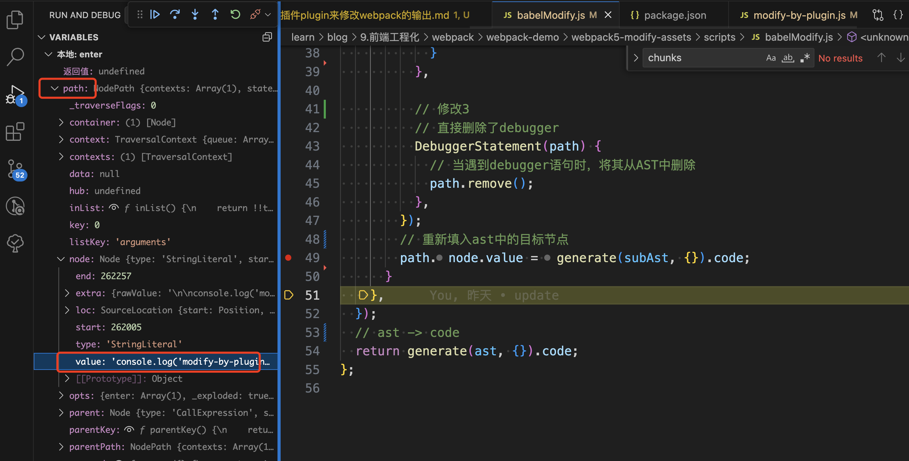
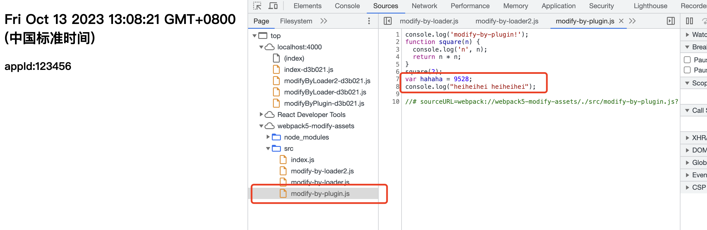

## 3-3.开发插件 plugin 来修改 webpack 的输出

plugin 有很多的生命周期，但是目标代码地址都在 compilation.assets，所以修改代码都是基于此。

### 开发一个 webpack 插件的[基本步骤](https://webpack.docschina.org/contribute/writing-a-plugin/#creating-a-plugin)

webpack 插件由以下组成：

1. 一个 JavaScript 命名函数或 JavaScript 类。
2. 在插件函数的 prototype 上定义一个 apply 方法。
3. 指定一个绑定到 webpack 自身的事件钩子。
4. 处理 webpack 内部实例的特定数据。
5. 功能完成后调用 webpack 提供的回调。

```js
// 一个 JavaScript 类
class MyExampleWebpackPlugin {
  // 在插件函数的 prototype 上定义一个 `apply` 方法，以 compiler 为参数。
  apply(compiler) {
    // 指定一个挂载到 webpack 自身的事件钩子。
    compiler.hooks.emit.tapAsync('MyExampleWebpackPlugin', (compilation, callback) => {
      console.log('这是一个示例插件！');
      console.log('这里表示了资源的单次构建的 `compilation` 对象：', compilation);

      // 用 webpack 提供的插件 API 处理构建过程
      compilation.addModule(/* ... */);

      callback();
    });
  }
}
```

### 本示例中的 plugin

**原始代码**：

```js
// webpack5-modify-assets/src/modify-by-plugin.js
console.log('modify-by-plugin!');
function square(n) {
  console.log('n', n);
  return n * n;
}

square(2);

debugger;

var hahaha = 9527;

console.log('heiheihei');
```

```js
// webpack5-modify-assets/scripts/babelModify.js
const parser = require('@babel/parser');
const fs = require('fs');
const traverse = require('@babel/traverse').default;
const generate = require('@babel/generator').default;
const types = require('@babel/types');

// 这里仍旧修改的是assets，但是对内部进行了二次ast转换，找到目标代码，进行了修改
module.exports = function (code) {
  // 拿到文件的code，转为ast结构
  const ast = parser.parse(code);
  fs.writeFileSync(__dirname + '/middle/input1.json', JSON.stringify(ast));
  fs.writeFileSync(__dirname + '/middle/input1.js', code);

  traverse(ast, {
    enter(path) {
      // 匹配到name是n的改为x
      // 这里匹配到目标source
      if (
        path.node.type === 'StringLiteral' &&
        path.node.value.includes(
          '# sourceURL=webpack://webpack5-modify-assets/./src/modify-by-plugin.js?',
        )
      ) {
        const subAst = parser.parse(path.node.value);
        fs.writeFileSync(__dirname + '/middle/input2.json', JSON.stringify(subAst));
        fs.writeFileSync(__dirname + '/middle/input2.js', path.node.value);

        traverse(subAst, {
          enter(path) {
            // 操作1，修改结果
            if (path.node.type === 'NumericLiteral' && path.node.value === 9527) {
              // 替换数值类型9527为9528
              path.node.value = 9528;
            }
            // 操作2，修改目标字符串
            if (path.node.type === 'StringLiteral' && path.node.value === 'heiheihei') {
              path.node.value = 'heiheihei heiheihei';
            }
          },

          // 修改3
          // 直接删除了debugger
          DebuggerStatement(path) {
            // 当遇到debugger语句时，将其从AST中删除
            path.remove();
          },
        });
        // 重新填入ast中的目标节点
        path.node.value = generate(subAst, {}).code;
      }
    },
  });
  // ast -> code
  return generate(ast, {}).code;
};
```

**经 plugin 处理**：

```js
// webpack5-modify-assets/scripts/plugin-modify.js

const pluginName = 'PluginModify';
const babelModify = require('./babelModify.js');

/**
 * 这里似乎可以这样理解：
 * 1. assets代表的是原始的代码，修改了会影响到目标结果；=> 修改模块代码:在 compilation 阶段，你可以监听 optimize-chunk-assets 事件，它会提供输出的 chunk 对象。你可以遍历这些 chunk，获取模块的代码，然后修改代码，最后通过 compilation.assets 对象将修改后的代码重新写入到输出文件中。
 *   1.1 都是走到了compilation.assets[fileName]；
 * 2. chunks和modules修改了也只是修改了，没什么用；
 * 3. compiler.hooks.normalModuleFactory应该也是同样的问题
 */

class PluginModify {
  constructor(options = {}) {
    this.options = options;
  }

  apply(compiler) {
    // 方式一
    compiler.hooks.emit.tapAsync(pluginName, (compilation, cb) => {
      //可遍历出所有的资源名
      for (var filename in compilation.assets) {
        // console.log('MyModifyOutput name==', filename);
      }
      compilation.chunks.forEach(function (chunk) {
        chunk.files.forEach(function (filename) {
          // compilation.assets 存放当前所有即将输出的资源
          let source = compilation.assets[filename].source();
          // 这里可以根据扩展名进行不同的操作

          if (filename.includes('.js') && filename.includes('modifyByPlugin')) {
            // 方式一
            source =
              "console.log('哈哈哈哈哈😄');\n" +
              source +
              "\n;console.log('add by plugin-modify-1!');";
            // 方式二
            // 通过babel分析后，结构化添加
            source = babelModify(source);
            source = `${source}`;
          }

          // 这里修改的是assets
          compilation.assets[filename] = {
            source: function () {
              return source;
            },
            size: function () {
              return source.length;
            },
          };
        });
      });
      cb();
    });

    // !这个会在emit前面添加
    compiler.hooks.compilation.tap(pluginName, (compilation) => {
      compilation.hooks.optimizeChunkAssets.tapAsync(pluginName, (chunks, callback) => {
        chunks.forEach((chunk) => {
          // 遍历块的所有文件
          chunk.files.forEach((file) => {
            if (file.endsWith('.js')) {
              // 获取文件内容
              // webpack处理过的代码
              let source = compilation.assets[file].source();
              // 在文件开头添加自定义注释
              source = `/* ¥¥¥¥¥¥¥¥¥¥¥¥¥¥¥¥¥¥¥¥¥ */\n${source}`;
              // 将修改后的内容写回文件
              compilation.assets[file] = {
                source: () => source,
                size: () => source.length,
              };
            }
          });
        });

        // 执行回调函数
        callback();
      });
    });

    compiler.hooks.done.tap(pluginName, (compilation) => {
      console.log('webpack 构建完毕！！！');
    });
  }
}

module.exports = PluginModify;
```





**目标结果**，这里首先通过 code 直接拼接的方式，添加了一段打印信息。然后修改了变量的 value，删除了 debugger 字段。
