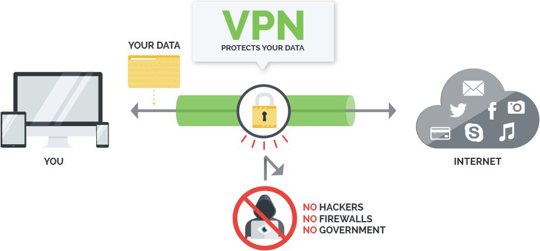

# 网络代理

## 通讯服务与流量服务

[参考文章](http://m.tibet.cn/wap/news/hot/1458606291227.shtml?yyue=a21bo.50862.201879)

[各种翻墙工具](https://10beasts.net/best-vpn-china/#best-global-vpn)

参与者

- 用户
- 用户的服务运营商
- 国外运营商
- 网关（海关）

也就是说，用户在国外，通讯费用需要经过，用户 -> 国外的运营商计费 -> 国内运营商收费。而网络流量是可以直接连接国外的服务网络的。

所以外国人在国内可以访问国外的网站，不需要经过国内的网关。
国人在国外也是不能访问国外的网站的。

## VPN

DNS(Domain Name System)域名服务器，它作为将**域名和 IP 地址相互映射**的一个**分布式数据库**，能够使人更方便地访问互联网。

GFW(Great FireWall)中国国家防火墙。

VPN 英文全称：`Virtual Private Network`（虚拟专用网络）。

VPN 被定义为通过一个公用互联网络建立一个临时的、安全的连接，是一条穿过混乱的公用网络的安全、稳定隧道，使用这条隧道可以对数据进行几倍加密达到安全使用互联网的目的，广泛使用企业办公当中，**虚拟专用网**也可以是针对企业内部网的扩展，虚拟专用网可以帮助远程用户、公司分支机构、商业伙伴及供应商同公司的内部网建立可信的安全连接，用于经济有效地连接到商业伙伴和用户的安全外联网虚拟专用网，因此很多办公一族在自己电脑中也需要建立 VPN 连接，方便远程办公等等。

## 翻墙原理

[参考文章](https://medium.com/@thomas_summon/%E6%B5%85%E8%B0%88vpn-vps-proxy%E4%BB%A5%E5%8F%8Ashadowsocks%E4%B9%8B%E9%97%B4%E7%9A%84%E8%81%94%E7%B3%BB%E5%92%8C%E5%8C%BA%E5%88%AB-b0198f92db1b)

通过在 GFW 后边建立 VPN，实现欺骗 GFW 的实际访问的地址的目的。在用户与 VPN 之间这一段，请求是被加密的。

### 目前主流翻墙手段的实现原理

GFW 实现网络封锁的手段主要有两种：**dns 劫持和 ip 封锁**。GFW 所做的就是站在用户和 dns 服务器之间，破坏它们的正常通讯，并向用户回传一个假 ip。用户拿不到真正的 ip，自然也就访问不到本想访问的网站了。

**在第三方架设翻墙服务器，中转与目标服务器间的来往流量**。目前为止，GFW 采用的是黑名单模式，像 Google、Facebook 这种在黑名单上的网站的 ip 无法访问，而不在黑名单上的第三方不记名 ip 可以。目前几乎所有的翻墙手段都是基于上述原理实现的。

### vpn、vps、Proxy 和 shadowsocks 翻墙

#### VPN

vpn 协议就存在诸多问题。最严重的一个就是流量特征过于明显。墙目前已经能够精确识别绝大部分 vpn 协议的流量特征并给予封锁，所以，vpn 这种翻墙方式基本已经废了。

#### Proxy

Proxy（代理）又分为正向代理和反向代理。翻墙所用的代理都是正向代理。反向代理的作用主要是为服务器做缓存和负载均衡。shadowsocks 的负载均衡是指：每隔一段时间更改一次翻墙服务器，将用户的数据**平均发给多个不同的翻墙服务器**，以避免发往某一个翻墙服务器的流量过多。

#### HTTPS

HTTPS 代理无论是安全性，还是在隐匿性，都要比目前最为流行的 shadowsocks 好。

#### VPS

（Virtual private server，虚拟专用服务器）是由 vps 提供商维护，租用给站长使用的“不会关机的电脑”。

vps 可以用来搭建网站，当然也可以用来承载 vpn 服务器、代理服务器或是 shadowsocks 的服务器啦。

#### shadowsocks

### Lantern 翻墙原理

lantern 的原理其实很简单，类似于曾经很流行的 p2p 下载模式，只是把以前各种用来分享的资源换成了各种网站而已。
简单的讲，就是全世界各地在墙外的人，安装上 lantern 以后，墙内的人通过 lantern 想要浏览墙外网站的时候，就会通过墙外安装了 lantern 的人的网络进行访问。除了这些志愿为你提供服务的 lantern 墙外安装者外，lantern 官方自己也有服务器提供了大量的流量，进一步确保了墙内浏览者的网络浏览速度。

#### lantern 和 VPN 的区别

VPN 一般采用的是固定 IP，专用服务器来进行连接的，类似于 lantern 自己的服务器，因为是固定 IP，所以比较容易被封，虽然可以及时更换 IP，但是毕竟不灵活。而且 VPN 一般会有限速，毕竟他的 lantern 的最大的特色就是分享和分散功能。分享能力使得它的网速可能会非常的快，快到和浏览墙内网站网速没差别，甚至能够在 youtube 上直接浏览 720p 的高清视频。分散能力使得 lantern 不会轻易被封掉，甚至是不可能被封掉。

### Hosts 文件

hosts 是一个没有扩展名的**系统文件**，其基本作用就是**将一些常用的网址域名与其对应的 IP 地址建立一个关联“ 数据库 ”**。

当用户在浏览器中输入一个需要登录的网址时，系统会首先自动从 hosts 文件中寻找对应的 IP 地址，一旦找到，系统就会立即打开对应网页。

如果没有找到，则系统会将网址提交 DNS 域名解析服务器进行 IP 地址的解析。

#### hosts 文件的 2.1 加快域名解析

- 加快域名解析

对于经常访问的网站，我们可以通过在 hosts 文件中配置域名和 IP 的映射关系，提高域名的解析速度。由于有了映射关系，当我们输入域名后，计算机就能够快速解析出 IP 地址，而不用请求网络上的 DNS 服务器。

- 构建映射关系

在很多单位中，都会有自己局域网，而且还会有不同的服务器提供给公司的成员使用。但**由于局域网中一般很少架设 DNS 服务器**，因此在访问这些服务器时，就需要输入难记的 IP 地址，这对大家来说相当麻烦。因此，我们可以分别给这些服务器取个容易记住的名字，然后在 hosts 文件中建立 IP 映射，这样在以后访问的时候，只要输入这个服务器的名字就 OK 啦！

- 屏蔽垃圾网站

现在有很多网站，在不经过我们同意的时候，就将各种各样的插件安装到我们的计算机中，其中不乏病毒和木马。对于这些网站，我们就可以**利用 hosts 文件把这些网站的域名映射到一个错误的 IP 或本地计算机的 IP 地址上，这样就可以达到禁止访问的目的了**，这里在付费软件查询的时候有用，切断了查询的路径。

在 MAC 系统中中，hosts 文件的位置为：`~/private/etc`

`202.108.22.5 www.baidu.com`我们在本地的 hosts 文件中，将百度的 IP 地址与百度的域名建立了映射关系，也就起到了“加快域名解析”的作用，因为不需要再去请求 DNS 服务器啦！

## 搭建 VPN 服务器

[谷歌云免费搭建一年 SSR 服务器](https://freeleox.github.io/2018/11/02/Google%20Cloud%20SSR/)
